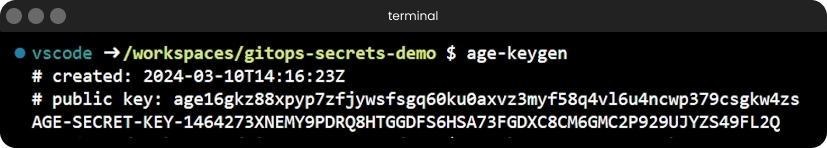
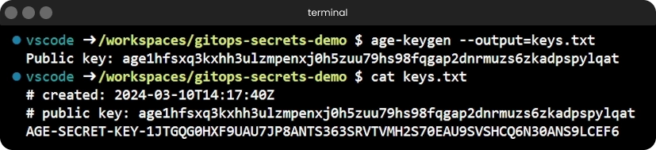
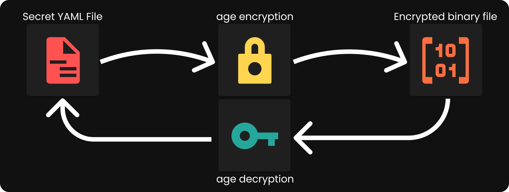
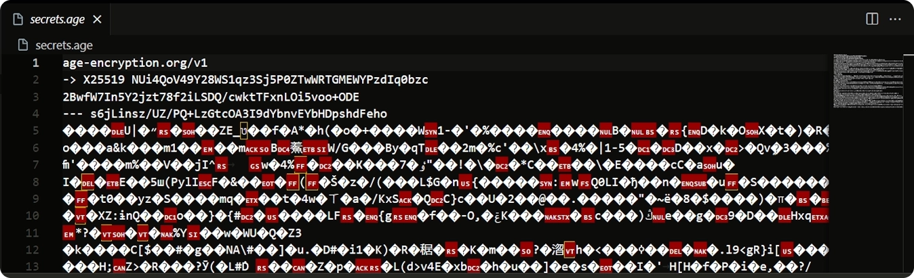
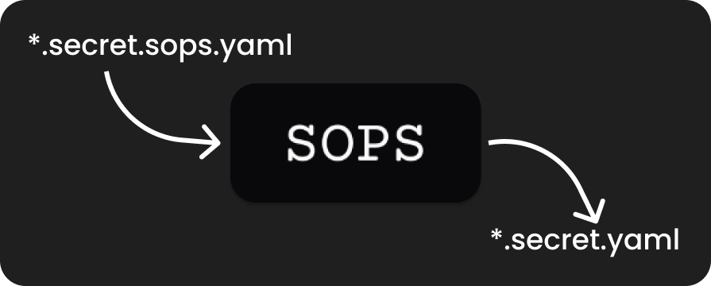

Alrighty then, let's talk GitOps.

I think it's pretty neat that you can push all your manifests to Git, and just like that, your cluster auto-magically syncs up seamlessly. I also think it's a bit of a pain to push **all** manifests to git, since among those manifests lurk some secrets that definitely shouldn't be out there for the world to see.

In this blog post, alongside a [YouTube video](https://youtu.be/wqD7k5iNvqs) I've put together, I'm going over one of the solutions that allows me to simply push those secret files to git without worrying about them.

## Context

The reason I'm writing this blog post right now instead of later is because in one of my previous blogs/videos I left you on a bit of a cliffhanger. Remember that [deep dive into Talos Linux](https://mirceanton.com/posts/2023-11-28-the-best-os-for-kubernetes) we took in the last post?

One of the key highlights I kept rambling on about was the fact that we can store the entire OS config in a YAML file and then simply push it to Git. While that does sound great, there's a catch! By the end of that video, those files weren't really ready for the `git push`.

Those files were packed with sensitive information, and putting them out there in the open, even in a private repo, would've been a recipe for disaster.

Thus, today we're taking a look at what we need to do in order to finally get those files, or any other secret files, ready for the push command.

Okay then, here's the game plan:

1. First up, we're installing `age` and generting our encryption key-pair,
2. Then, we're going to encrypt our Talos secrets file using the public key, and decrypt it using the private key,
3. Next, we're bringing in `sops` to see how it works together with age to make our lives easier,
4. We're going to encrypt and decrypt our Talos secrets file again, but this time using `sops` and we're going to look over the differences.
5. Finally, I'll sprinkle in a couple of my own tried-and-tested tips and tricks from my GitOps repository to keep those secrets snug as a bug in a rug. 😉

With all that preamble out of the way, let's dive right in!

## Age


_AGE Encryption Tool Logo_

Before going into the installation process, let's briefly discuss what `age` is.

In essence, `age` is a simple, modern and secure (not that you'd want the thing that encrypts your files to be anything but secure) file encryption tool, format, and Go library. It facilitates the encryption and decryption of files into/from a binary format.

### Installing age

Installing age is a breeze. It's the same old process of installing precompiled binaries from GitHub, but here's a quick rundown of what you need to do:

Head over to the [age GitHub Repository](https://github.com/FiloSottile/age/), navigate to the [releases section](https://github.com/FiloSottile/age/releases), and grab the [latest release](https://github.com/FiloSottile/age/releases/latest) (which is `v1.1.1` at the time of writing this).

Once you've got the archive downloaded, unzip (or rather, untar) its contents and move the executables to a directory in your system's `$PATH`. This ensures you can access them from anywhere. Make sure to also add the executable flag to them.

All in all, the installation script should look something like this:

```bash
export AGE_VERSION=v1.1.1

# Download the archive
wget https://github.com/FiloSottile/age/releases/download/$AGE_VERSION/age-$AGE_VERSION-linux-amd64.tar.gz

# Extract the contents of the archive
tar -xvf age-$AGE_VERSION-linux-amd64.tar.gz

# Move the binaries to a directory in our PATH
sudo mv age/age* /usr/local/bin/

# Make the binaries executable
sudo chmod +x /usr/local/bin/age*
```

Now, to verify that everything's set up correctly, run:

```bash
age --version
age-keygen --version
```

Now that we've got age installed, let's dive into how we can use it to encrypt and decrypt our files.

### Generating the age keys

Just like we need to generate our `ssh` key via `ssh-keygen` prior to `ssh`-ing around, we also need to generate our `age` key using `age-keygen` before we can encrypt and decrypt files.

If we run the `age-keygen` command all by itself, it will simply dump both the private and the public key into the terminal, which is not ideal.


_`age-keygen` command output_

You want to keep your private key somewhere safe, since you need it to decrypt anything the public key encrypts. If you're like me and prefer things tidy, you can put that private key straight into a file with the `-o`/`--output` flag:

```bash
age-keygen --output=keys.txt
```

This command will only print the public key to your standard output and redirect a similar output to the one we've seen earlier to the `keys.txt` file. The same thing can be achieved using regular output redirection, but I personally prefer the CLI flag.


_`age-keygen` command output redirection to `keys.txt`_

### Encrypting and Decrypting Files with `age`


_AGE Encryption and Decryption Diagram_

With the keys sorted, let's encrypt a file. For this demo, I'll be using our `secrets.yaml` file from the [Talos Linux blog post](https://mirceanton.com/posts/2023-11-28-the-best-os-for-kubernetes), but literally any kind of file will work.

Just run the `age --encrypt` command, toss in the public key we generated earlier as the `--recipient`, point `age` to the file we want to encrypt (`secrets.yaml`), and redirect the encrypted version away in `secrets.age`.

```bash
age --encrypt --recipient=<key> secrets.yaml > secrets.age
```

If you try to view the contents of `secrets.age`, you'll notice that it's in binary format. The content is not human-readable and we can't get to our secrets that are stored inside it. This encrypted file is now secure and can only be decrypted with the corresponding secret key - the one we put in `keys.txt`.


_Sample of file encrypted using `age`_

Now, let's try and decrypt the file and see what we get.

Similarly, we're now running the `age --decrypt` command, we tell it where your private key file is located (`keys.txt`), we point it to the encrypted file (`secrets.age`), and _voilà_! Your secrets are back in the open!

By default it will all be dumped in your `stdout`, but you can easily redirect that output to a file, say `secrets-decrypted.yaml`

```bash
age --decrypt --identity=keys.txt secrets.age > secrets-decrypted.yaml
```

If we now compare the original file with the decrypted one using `diff`, we'll see that they are indeed one and the same - a perfect match:

```bash
diff secrets.yaml secrets-decrypted.yaml
```

### Why do we need more? 🤔

At this point, you may be asking yourself the same question I was asking myself when I was first looking into this topic and watching YouTube videos and reading blog posts about SOPS and age:

> Given that our files are now safe and secure in a binary format, shall we push them to git like this?

WELL... I mean yeah sure we could, but that'll be silly for a multitude of reasons, mainly for the developer experience.

Functionally speaking, it works, but practically speaking it will be a pain and we can definitely do better, so let's!

## Mozilla SOPS


_Mozilla SOPS Logo (there's at least 3 pixels in that photo)_

Before we go ahead with the installation process, let's clarify what `SOPS` is all about.

SOPS, or "Secrets OPerationS", is a tool for managing sensitive data within files. While it by itself is **not** an encryption tool, `SOPS` excels at selectively encrypting specific values within files, ensuring that your sensitive information remains secure while leaving the rest untouched.

Fundamentally, all YAML is just a bunch of key-value pairs nicely formatted in a file. What `SOPS` can do (that `age` can't) is that it is aware of these keys and values and it can encrypt the values only, leaving the keys untouched. This way the file is still somewhat readable so we can still work with it, all while exposing no secret information. Even more, it can encrypt only the values associated to keys matching a given regex, so it's not even required to encrypt an entire file if all you need is a single entry.

Given that `SOPS` cannot encrypt files by itself, it can make use of various encryption backends, including AWS or GCP KMS, Azure Key Vault, PGP and - drum roll, please 🥁 - `age`! Can you guess which one we're going to use? 😆

### Installing SOPS

Just like installing `age`, we need to go to the [SOPS GitHub repository](https://github.com/getsops/sops) and navigate to the [releases section](https://github.com/getsops/sops/releases). This time, we actually find a handy script with all the commands we need right there.

Taking a quick look at the commands before we're running them, we can see that we're just downloading the binary file, adding it to our `$PATH` and making it executable - the same old standard procedure. This time, as opposed to the `age` installation, we're downloading the binary directly instead of an archive, so there's no need to `untar` things.

```bash {file="mozilla-install.sh"}
export SOPS_VERSION=v3.8.1

# Download the binary
curl -LO https://github.com/getsops/sops/releases/download/$SOPS_VERSION/sops-$SOPS_VERSION.linux.amd64

# Move the binary in to your PATH
mv sops-$SOPS_VERSION.linux.amd64 /usr/local/bin/sops

# Make the binary executable
chmod +x /usr/local/bin/sops
```

To make sure the installation was successful, run:

```bash
sops --version
```

Now that SOPS is up and running, let's actually use it.

### The `.sops.yaml` config file

To simplify our workflow and avoid having to run very long commands, we'll create a configuration file for SOPS. Essentially, this file will define parameters that would otherwise clutter our command line with numerous arguments - arguments we'd have to specify for each and every command based on the target file. 😅


_The `sops` config file_

This config file defines a list of "creation rules". These rules instruct SOPS on how to handle the various files we will process with it, based on a regex matches with their names/paths.

If we break this down bit by bit, we can see that this particular creation rule we defined will handle all files with a `path_regex` matching `/*secrets(\.encrypted)?.yaml$`. What this regex essentially does, is that it matches any `secrets.yaml` (notice the question mark at the end of `(\.encrypted)?`) or `secrets.encrypted.yaml` file anywhere (recursively) within our current directory.
We also added in the `(\.encrypted)?` part because that is the name we will give to our Talos secrets file after we encrypt it.

Going a bit further, the `encrypted_regex` tells sops the values of which keys from the YAML file it needs to encrypt. In this case, the regex `"^(id|secret|bootstraptoken|secretboxencryptionsecret|token|ca|crt|key)$"` essentially tells sops to encrypt the values associated to any of the keys in that list.

And finally, the `age` line just specifies the `age` **public** key which will be used to encrypt the values in the file.

With our configuration file in place, executing SOPS commands becomes a breeze as it automatically infers the necessary CLI arguments based on the rules defined within the file.

### Encrypting and Decrypting Files with `sops`

Encrypting our file is a simple process now that we have our config file in place. SOPS will automatically look for a `.sops.yaml` file in our current directory, so all we really need to do is to simply utilize the `sops --encrypt` command and specify the file we want to encrypt. This command will dump the encrypted content in our `stdout`, so we can either:

- redirect the output to another file using the `-o`/`--output` flag,
- redirect the output using "standard" output redirection `>`,
- overwrite the original file using the `-i`/`--in-place` flag;

Personally, I prefer the second option. I dislike the `-o` flag because it forces me to specify the output file before the input file and that just looks and feels weird to me. As for the 3rd option, I never encrypt my files in place since I like to have a distinction between plain and encrypted files.

```bash
sops --encrypt secrets.yaml > encrypted.yaml
```

Taking a look at the `encrypted.yaml` file, you'll notice it's far more legible than the plain (well, binary, actually 🤓) `age` encrypted version. All keys remain intact, while the values are now safely encrypted.

Moreover, SOPS is adding a `sops` section to our resulting yaml file. This section contains additional informatio such as the last update timestamp, the SOPS version used, the encrypted regex applied and the public age key file.

Moving on to decryption, it's a bit more complicated than encrypting the file since it requires one extra step to be completed before.

By default, SOPS is not aware of our private `age` key file and where to find it in order to decrypt our files. Thus, if we try now to decrypt our encrytped file, SOPS will simply fail:


_The `sops --decrypt` command failing due to missing age key_

To fix this, we have a couple of options:

1. set the `SOPS_AGE_KEY_FILE` environment variable to the path of our secret age key file

   ```bash
   export SOPS_AGE_KEY_FILE="$(pwd)/keys.txt"
   ```

2. Put our `keys.txt` file under `~/.config/sops/age/keys.txt` (the default location sops will automatically look in)

   ```bash
   mkdir -p ~/.config/sops/age
   mv keys.txt ~/.config/sops/age/keys.txt
   ```

With either of those 2 options applied, we can now decrypt our encrypted file without passing in any additional CLI arguments:

```bash
sops --decrypt encrypted.yaml > decrypted.yaml
```

With the file decrypted, we can compare it to the original using `diff`. If they match, we're good to go. (spoiler alert: they do)

```bash
diff secrets.yaml decrypted.yaml
```

And with all this, we can now confidently push our SOPS-encrypted secrets file to Git, knowing we can decrypt them with our private age key.

## Tips and Tricks

Managing secrets effectively in a GitOps setup takes more than just encryption and decryption. Here are some tips and tricks I've picked up along the way to streamline the process and keep my secrets safe and sound.

### Naming Conventions


_Naming convention diagram_

Keeping your secrets safe is the name of the game, and it starts with a solid name-ing (see what I did there? 😉) convention and Git configuration.

In my GitOps repository, I adhere to a fairly strict naming convention for my Kubernetes manifest files. Each file follows the `<resource-name>.<resource-type>.yaml` format. For example, a `ConfigMap` named `foo` is stored in a file called `foo.configmap.yaml`.

> Why am I doing this and why is it relevant?

Oh, I thought you'd never ask!

Starting with the "_why are you doing this_" part, it's fairly simple. Before setting this all up I was encrypting and decrypting secrets in place. Initially by hand and after a while using some scripts. The problem here is that I have (on multiple occasions even 😅) accidentally pushed unencrypted secret files to git without realizing. I even accidentally pushed my private age key once, but we don't speak of that 😆

As for the "_why is it relevant_" bit - well, this essentially means that all files containing secrets end with `.secret.yaml`. I know ahead of time what is the naming format for any file that needs to be encrypted and **should not make it to git**.

This allows me to easily identify and exclude them from version control using `.gitignore` by simply adding a `*.secret.yaml` in there. I then expand on this for any other kind of secret files, such as `talhelper` secrets -> `talsecret.yaml` (spoiler alert for future video 😉), `terraform` values -> `*.auto.tfvars` and so on.

### Bulk Processing Bash Scripts


_The `sops` wrapper bash scripts_

Since I, as many other people in DevOps, share the mindset that manually doing something that takes 10-30 seconds is stupid but spending 5-7 business days trying (failing) to automate it sounds like a hell of a plan, I ended up writing some bash scripts to automate my secret encryption and decryption.

There are 2 main pain points which I tried to solve with these bash scripts:

1. I hate having to manually type out the whole path to a file to encrypt it. I want the script to auto-scan the repo and detect which files need to be encrypted
2. Re-encrypting the same file twice will yield different results. If I needleslly re-encrypt **all** secret files in my repo, my git history will be a mess and I don't want that. The script should be smart and only encrypt files if they need to be encrypted.

Thus, my two wrapper scripts for `sops` were born.

#### Encryption Script

```bash {file="scripts/sops-encrypt-all.sh"}
#!/bin/bash

GREEN='\033[0;32m'
RED='\033[0;31m'
NC='\033[0m'

while IFS= read -r path; do
    path=$(echo "$path" | sed 's/\(\.sops\)/ /g')
    find . -regextype egrep -regex ".*/$path" -type f | while IFS= read -r file; do
        encrypted_file="${file%.yaml}.sops.yaml"

        if [ -f "$encrypted_file" ]; then
            # Decrypt the encrypted version
            decrypted_temp=$(mktemp)
            sops --decrypt "$encrypted_file" > "$decrypted_temp"

            # Compare the decrypted version with the file on disk
            if cmp -s "$file" "$decrypted_temp"; then
                echo -e "${GREEN}No changes detected. Skipping encryption for file: $file${NC}"
            else
                echo -e "${RED}Changes detected. Re-encrypting file: $file${NC}"
                sops --encrypt "$file" > "$encrypted_file"
            fi

            rm "$decrypted_temp"
        else
            # No encrypted version exists, encrypt the file
            echo -e "${RED}Encrypting file: $file${NC}"
            sops --encrypt "$file" > "$encrypted_file"
        fi
    done
done < <(grep -oP '^\s*- path_regex:\s*\K.*' ".sops.yaml")
```

This script searches for all files matching the `path_regex` entries in my `.sops.yaml` configuration file. For each file found, it checks if an encrypted version already exists (i.e. if `<file>.sops.yaml` exists).

If an encrypted version doesn't exist, it simply encrypts the `<file>.yaml` into `<file>.sops.yaml`.

If an encrypted version does exist, it decrypts it in memory and compares the content of the existing encrypted file with the plain file. If they differ, it overwrites the encrypted file, but if they are the same it will skip over the file without re-encrypting it.

This last check is the important bit which prevents my git history from getting all messy,

#### Decryption Script

```bash {file="scripts/sops-decrypt-all.sh"}
#!/bin/bash

GREEN='\033[0;32m'
RED='\033[0;31m'
NC='\033[0m'

force=false

while [[ $# -gt 0 ]]; do
    key="$1"
    case $key in
        -f|--force)
            force=true
            shift
            ;;
        *)
            echo "Unknown option: $1"
            exit 1
            ;;
    esac
done

find . -regextype egrep -regex "\.\/.+\/.*.sops.yaml" -type f | while IFS= read -r file; do
    decrypted_file="${file%.sops.yaml}.yaml"

    if [ -f "$decrypted_file" ]; then
        # Decrypt the encrypted version
        decrypted_temp=$(mktemp)
        sops --decrypt "$file" > "$decrypted_temp"

        # Compare the decrypted version with the existing decrypted file
        if cmp -s "$decrypted_file" "$decrypted_temp"; then
            echo -e "${GREEN}No changes detected. Skipping decryption for file: $file${NC}"
        else
            if [ "$force" = true ]; then
                mv "$decrypted_temp" "$decrypted_file"
                echo -e "${RED}File replaced with the decrypted content: $decrypted_file${NC}"
            else
                echo -e "${RED}Changes detected. Use -f or --force flag to overwrite $file${NC}"
            fi
        fi

        if [ -f "$decrypted_temp" ]; then
            rm "$decrypted_temp"
        fi
    else
        # No decrypted file exists, decrypt and create it
        echo -e "${RED}Decrypting file: $file${NC}"
        sops --decrypt "$file" > "$decrypted_file"
    fi
done
```

---

Similarly, this script searches for all files ending with `*.sops.yaml`.

For each encrypted file found, it checks if the associated plain file exists.

If a plain file with the same name (sans the `.sops`) already exists, it compares the content of the decrypted file with the existing plain file.

If they are the same, the file is simply skipped over, but if they are different then an alert gets printed.

Note that the script will **not** overwrite the plain secret file unless the `-f`/`--force` flag is passed in. The reason for prioritizing the plain file over the encrypted one is that there logically is no reason for the two files to be different and the encrypted one to be the most up-to-date.

If I am to change the encrypted file, I need to change the plain file first and then re-encrypt.

### Taskfile to the Rescue


_Taskfile Logo_

Finally, my last gripes with this setup are quite trivial and minor, but while I was at it I decided to solve everything.

First off, I wanted to be able to run those two scripts without having to be mindful of where I am in my repository relative to the root. I wanted to just run a command and have it do its magic.

Secondly, I am lazy and even having to type `bash scripts/sops-encrypt-all.sh` is quite a lot. I'd need an alias or something for this.

Well, thankfully I was already using `Taskfile` in my HomeOps repository for other things, so it will also nicely handle all these my complaints.

I will not cover what Taskfile is, how to use it or how to set it up in this post, as it is outside of the scope. Think of this as a teaser, an "exercise left for the reader" if you will 😉

What I had to do to set this up is that I had to add this snippet in my `Taskfile.yaml`:

```yaml {file="Taskfile.yaml"}
---
version: "3"

tasks:
  sops:encrypt:
    aliases: [enc, e]
    desc: Encrypt all sops files in this repository.
    run: once
    cmds:
      - bash {{.ROOT_DIR}}/scripts/sops-encrypt-all.sh

  sops:decrypt:
    aliases: [dec, d]
    desc: Decrypt all sops files in this repository.
    run: once
    cmds:
      - bash {{.ROOT_DIR}}/scripts/sops-decrypt-all.sh {{.CLI_ARGS}}
```

This essentially allows me to run:

- `task sops:encrypt` / `task sops:enc` / `task sops:e` to encrypt all of my secret files
- `task sops:decrypt` / `task sops:dec` / `task sops:d` to decrypt all of my secret files

It all depends on how lazy I'm feeling, really 😆

---

<center>

📹 [Watch Video](https://www.youtube.com/watch?v=wqD7k5iNvqs)

</center>


