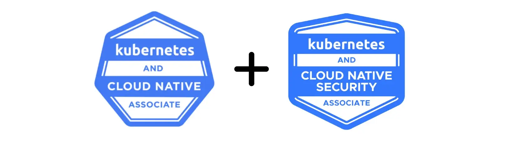

Back in '22 (2022, that is), I decided to challenge myself and get all three Kubernetes certifications within 3 weeks. One week per exam. Looking back, I'm not entirely sure if this was ambitious or just plain stupid, but hey, I pulled it off! Let me walk you through my entire journey, exam by exam, and hopefully save you from some of the pain I went through.

As a junior DevOps engineer with about 1.5 years of experience at the time, I felt reasonably confident going into this challenge. It appears that my confidence was justified for two of the exams, but the third one... well, we'll get to that.

## Week 1: CKA

### The Exam Itself

I started with the CKA on December 6th 2022, and honestly? It went pretty well! I managed to complete all of the questions within about 60 minutes, strategically leaving the 2-3 more time-consuming ones for the end. After finishing an initial run through all the questions, I went back to verify my answers. I finished these 2 passes over the exam within about 75-80 minutes, leaving me with around 40 minutes to tackle those more difficult questions. Eventually, I solved those as well, with about 10 minutes to spare!

In terms of difficulty, I found the average question to be much simpler than the mock exam from killer.sh and roughly on par with the KodeKloud labs. This was a pleasant surprise since killer.sh had me sweating bullets during my prep...

### Technical Hiccups

Now, it wasn't entirely smooth sailing. My webcam was unable to take a clear picture of my identification. I kept showing my ID to the webcam, but the proctor was claiming they could not get a proper read of my name on it and would not let me in...

I had to scramble around the house and grab a different laptop in order to take the exam. Not ideal when you're already a bit nervous, but I managed.

Aside from this minor inconvenience, I found the PSI interface during the exam to be fairly responsive. I know there's a lot of people out there who say it is bad, unusable and terrible, but that wasn't my experience with the CKA at all. While there were a couple of instances where the video feed would freeze for a second or two, just enough to get my heart to skip a beat, overall it was a decent experience.

**Pro tip**: Have a decent external webcam with a **long** USB cable. I took the exam with the camera built into the laptop and it was both funny and awkward when I had to pan it around the entire room to show my surroundings to the proctor. Especially when I had to get under the desk. Learn from my mistakes.

---

I passed with a score of **95**! 🎉🎉🎉 Needless to say, I was thrilled. One down, two to go!

## Week 2: CKAD

Og boy... buckle up for this one. This is where things went completely off the rails.

My CKAD exam was scheduled for 10 AM on December 13th 2022. Precisely one week after my CKA. I started my check-in process at around 9:55. Now, I know you can start the check-in up to 30 minutes before, so I did not expect to finish the admission procedure in 5 minutes. I also did not expect the system to work so poorly.

Initially, I managed to get into my exam with a single try on the admission process, which was a nice change. As I started the exam, about 5 minutes in, just after I finished the first question, I got a pop-up on my screen that my network was unstable (I was using a wired connection,mind you). A few moments later the app just... closed.

Not particularly what I expected, but not the end of the world. I can simply restart the app and get back into the exam, right?  
**WRONG.**

I restarted the PSI secure browser app and I ended up waiting **over 1 hour** to be able to get back in. I must have gone through the admission process about 4 or so times. The first time, the app just glitched and when the proctor finished my admission I was simply redirected back to the start of the admission process again.

Annoying, but I proceeded to do it again.

This time, I waited around 15 minutes and nobody approved my admission or answered my messages. Eventually, a support representative entered the chat and we talked for about 10-15 more minutes. They then said they don't understand why the proctor is not answering any messages and that I should exit the app and redo the admission process again, to get a different proctor assigned.

Ultimately, I managed to get back into my exam at around **11:30**. As I got in, I realized, to my surprise, that the timer for my exam never actually stopped... 🙃

I messaged the proctor via the Live Chat feature and told them I find this unacceptable, that I am left with 50 minutes to complete a 2-hour exam, but they did not respond, so I just took my loss and started blasting through the questions. The proctor responded eventually and said there is nothing they can do as they have no access to the timer.

So yeah... I was left with 50 minutes to do a speedrun through my CKAD exam, all because of their terrible admission process and proctors that ghosted me.

### The Exam Difficulty (What I Could See of It)

Despite everything, I would say the exam itself was fair in terms of difficulty. Given a proper 2-hour duration, it would have easily been doable to go through each question 2-3 times. As I already mentioned, I was left with 50 minutes only to go through all my questions and I managed to speedrun through all but one.

Granted, I had no time to verify my work, but I did get an "initial implementation" on all of the questions in about 50 minutes.

---

I managed to pass the exam, but I still don't think that changes anything! What happened is still **unacceptable**. I understand that I may have had a network cutout or something of the sort. I understand the app "had to" kick me from the exam. What I do not understand and find inexcusable is that the timer for my exam never stopped and that they did not implement any priority queueing or something similar for people that are trying to get back into their exams.

## Week 3: CKS

After the CKAD disaster, I was pretty nervous about taking another exam with PSI. But I was already two exams deep into my 3-week challenge, so there was no backing out now. Momma didn't raise no quitter!

Personally, I found the CKS to be more difficult than either of those. Granted, this was most likely due to my lack of exposure to the topics covered on the CKS exam in my career thus far, as a Junior DevOps engineer, but still.

### Difficulty Tier List

Here's how I'd rank the various CKS topics:

**Very Easy** (one or two basic commands):

- Using `kubesec` to scan and fix manifest files
- Using `trivy` to scan images

**Easy** (should be second nature if you've done CKA/CKAD):

- Setting up `AppArmor` profiles
- Configuring `seccomp`
- Creating `network policies`
- Managing `service accounts` with the appropriate `roles` and `rolebindings`

**Moderate** (not difficult, but time-consuming):

- Setting up `admission controllers`
- Editing the static pod definition files to secure the cluster

I placed these tasks in this category since validating your work can be quite time-consuming since you are editing the static pod manifests on the master node and it can take a bit for the pods to be recreated.

**Difficult** (most challenging part):

- Managing `Falco` configuration
- Configuring `Falco` rules

In my opinion, this was the most difficult and time-consuming part of the exam. I had not used Falco before and I felt that the amount of practice I was able to get before the exam was insufficient to properly "master" it.

### Technical Aspects

On the technical side, everything went smoothly this time! Unlike my terrible CKAD experience, I did not have any issues with the PSI system and the check-in process was relatively quick and efficient. The connection was stable throughout the exam with no dropouts, so I had no complaints in this regard.

I would go as far as to say it was almost a flawless experience, but since it is the first and only time things went so well, I am reluctant to make any bold claims. If I were to take another exam with PSI tomorrow, I wouldn't expect it to go this well again, so take that with a grain of salt.

---

While I did manage to pass, my score was considerably lower than my CKA and CKAD. I really should have taken more than 1 week to prepare for this one. The curriculum overlap with CKA/CKAD was minimal, and the security-focused topics were not as fresh in my mind from daily work.

## Postlude: Going for Kubestronaut

So, back in December 2022, I completed the CKA, CKAD, and CKS exams and thought I was done with Kubernetes certifications. Those were the only three that existed at the time, and I was pretty happy with my achievement. Mission accomplished, right?

Well... not quite.

Fast forward about 2 years, and the Linux Foundation decided to add two more certifications to the mix: the **KCNA (Kubernetes and Cloud Native Associate)** and the **KCSA (Kubernetes and Cloud Native Security Associate)**. These weren't around when I took my original three exams. They're brand new entry-level certifications designed to be more accessible.

And here's the thing... they also introduced the **Kubestronaut** program. Complete all five certifications, and you get a coveted Kubernetes vest.

So despite having "completed" my Kubernetes certification journey years ago, I found myself signing up for two more exams. Not because I needed them for my career. Not because I felt my knowledge was incomplete. Nope. I came back purely for the vest. And I'm not even ashamed to admit it.
I **really** wanted that vest. 😅

### KCNA and KCSA

The thing about the KCNA and KCSA is that they are entry-level certifications. I do find it a bit weird, if I'm being honest, that they added 2 certifications that you're meant to take _before_ the 3 that they already had, instead of going for some more advanced ones, but oh well.

The point for the KCNA and KCSA is mainly to get you introduced to and get your feet wet with Cloud Native technologies in general. These are not practical exams, which I do personally dislike, but again, they're supposed to be your entry into all this. They are supposed to be the (among the) first certs you're getting on your journey so I can't fault them here for going a bit easier.

I still took them a week apart, each on a saturday, the KCNA on 31st of Nov 2024 and the KCSA on the 6th of Dec 2024 (apparently December is my certification month or something) but to be honest you can probably take these two back to back no problems. Matter of fact, I did schedule my CGOA (Certified GitOps Associate) the same day asmy KCSA after seeing how easy the KCNA was.

KodeKloud, once again, has extremely good courses for these certifications. But honestly? If you've done the CKA/CKAD, you'll find yourself skipping through most of the content because you already know it.

### The PSI Experience (Take 4 and 5)

Now, given my absolutely stellar track record with PSI at this point, I decided to take some precautions. I wasn't about to let another admission process disaster ruin my exams.

I set up an **empty room** specifically for these exams, invested in a proper **Elgato Facecam** (not SPECIFICALLY for these exams, but for my setup in general), and made sure I had **good lighting**. Basically, I created a mini exam center in my house to eliminate any possible technical issues on my end.

And you know what? Surprisingly, I did not have any issues with PSI this time! Both exams went smoothly. Well, all 3 actually, if we count the CGOA too, but we're not talking about that here. Whether that was because of my preparations or because multiple-choice exams have a different (read: simpler) technical setup, I can't say for certain. But hey... a win is a win.

### Was It Worth It?

Eh... The KCNA and KCSA are not challenging if you already have the other certifications. I can't really say they add much if you already have the CKA, CKAD and/or CKS. If you don't care about the vest, just get the main 3... but that Kubestronaut vest is pretty sweet, if I do say so myself. 😎

I will admit I took the KCNA and KCSA only for the vest. I can't say I learned much if anything at all from them that I did not already know at that point. Though to be fair by Dec 2024 I was already working as a DevOps engineer for ~2-3 years.

That being said... If you're considering going for the full Kubestronaut title, I'd recommend this approach:

1. Start with KCNA (easiest, builds foundation)
2. Move to CKA (practical foundation)
3. Then CKAD (builds on CKA)
4. Follow with KCSA (security basics)
5. Finish with CKS (hardest, requires CKA as prerequisite anyway)

This way, you build up gradually instead of doing what I did and taking the hardest ones first. But hey, that wasn't an option _back in my days_. 🤷

## Usefule Resources

For all five exams, I relied **heavily** on the **KodeKloud courses** and their labs. I think they are an amazing and invaluable resource for these certifications. Everything you need to know is covered in the course and labs.

For the practical exams (CKA, CKAD, CKS), I would go as far as to say that you can almost certainly pass with KodeKloud combined with the **killer.sh mock exam** and nothing else.

For the multiple-choice exams (KCNA, KCSA), the KodeKloud courses are more than sufficient on their own, though if you are an active member of the community, either proffesionally or as a homelabber, you have a decent shot and going in blind and acing them.

However, I do have one complaint: While KodeKloud was excellent for the CKA and CKAD, I found the CKS course quality to not be up to par compared to the other two, at least at the time of taking it back in December of 2022. It still covered the entire curriculum, just not as thoroughly as I came to expect from them. For the CKS specifically, I would recommend taking more than 1 week to prepare and supplementing with additional resources.

One thing worth mentioning: if you're taking these exams back-to-back like I did, be aware that there's quite a lot of overlap:

- **CKA and CKAD**: About 75% overlap in course content
- **KCNA and CKA/CKAD**: If you have CKA/CKAD, KCNA will feel like a review
- **KCSA and CKS**: Similar relationship - KCSA covers security basics that CKS dives deep into
- **CKS and CKA/CKAD**: Minimal overlap - CKS is its own beast focused on security

This can work to your advantage if you plan your exam schedule strategically.

## Final Thoughts and Recommendations

### On the Journey

Looking back, I'm glad I challenged myself to get these certifications in a relatively short timeframe. It forced me to stay focused and maintain momentum. The initial 3-week challenge for the "big three" was intense, and adding the two entry-level exams later to complete the Kubestronaut title felt like a victory lap in comparison.

If I could do it over again, I would structure it differently:

**Optimal Path** (6-8 weeks total):

- **Week 1**: KCNA (warm up with the easiest one)
- **Week 2-3**: CKA (build practical foundation)
- **Week 4**: CKAD (leverage CKA knowledge)
- **Week 5**: KCSA (security concepts introduction)
- **Week 6-7**: CKS (give this one the time it deserves)
- **Week 8**: Buffer week for any retakes or additional study

**Difficulty Ranking**: CKS > CKAD > CKA > KCSA > KCNA

**Time Management**:

- CKA: Very doable in 2 hours, plenty of time to verify your work
- CKAD: Fair difficulty, 2 hours is adequate (assuming PSI doesn't steal half your time)
- CKS: More time-consuming, those Falco questions will eat up your minutes
- KCNA/KCSA: Multiple choice, manage your time but they're straightforward

### On PSI

I'll be honest here: I would not recommend taking an exam with PSI based on my experiences. Out of the 7 PSI-proctored exams I've taken, only 4 went smoothly, and for those I took extra precautions that I would not consider practical in most cases. Not everyone has a room in their house they can get more or less empty and leave just a desk in there!

That's almost **40% failure rate** for PSI's admission and proctoring process working as intended for their exams in general, and only when I basically built a professional exam center in my house did things go smoothly. I'm not sure if the underlying process is different for practical vs multiple-choice exams, but if we do remove the 3 multiple-choice exams from the statistic, well then only 1 of 4 practical exams went well for me...

The lack of any failsafe for candidates who get disconnected is a massive oversight. No timer pause, no priority queue to get back in, no acknowledgment that their system might be at fault. Just a "sorry, nothing we can do" from the proctor. I did email them too about this and to this day (3y later) I got nothing.
