I "recently" (like... almost a year ago at this point 😅) upgraded from my DIY OPNsense setup to a MikroTik RB5009. You can watch my [YouTube Video](https://www.youtube.com/watch?v=k5eShv6l1ts) for the full story of the why, what and the how.

After much ado and months of procrastination, I'm finally getting started with my Terraform-Mikrotik network automation. This post will not be a full-blown guide or walk-through. Rather, I am just aiming to show you how to:

1. Connect Terraform to Mikrotik,
2. Import the default Mikrotik configuration that comes with my RB5009 into Terraform,
3. Make the *least* amount of changes necessary to get internet access.

This might not seem like much, but the aim is to set up a solid base for my network automation going forward. At the end of this post (hopefully), my entire Mikrotik router will be terraform-managed!

I should mention that I'm completely new to MikroTik devices. This RB5009 is more or less my first one (I had a CSS switch a while ago but that's not "managed")! I'm learning how to manage it as I go along, so if you're also new to MikroTik, I hope you'll find this especially helpful since I'll be explaining things from a beginner's perspective rather than assuming much prior knowledge.

## Prerequisites

If you want to follow along you don't really need much for this one:

- A MikroTik router

  I am using my RB5009, but realistically, any **RouterOS** device will do. Be advised, however, that if you are using a different device you will likely have to edit the commands and snippets I'm sharing here since our default configs will be different.  
  With that being said, the operations and concepts should still be applicable.

- Terraform CLI installed on your machine

  You can follow the official [installation guide](https://developer.hashicorp.com/terraform/tutorials/aws-get-started/install-cli) or use whatever package manager you fancy.
  For this tutorial, I will once more be using [`mise`](https://mise.jdx.dev/) to manage my dev tools:

  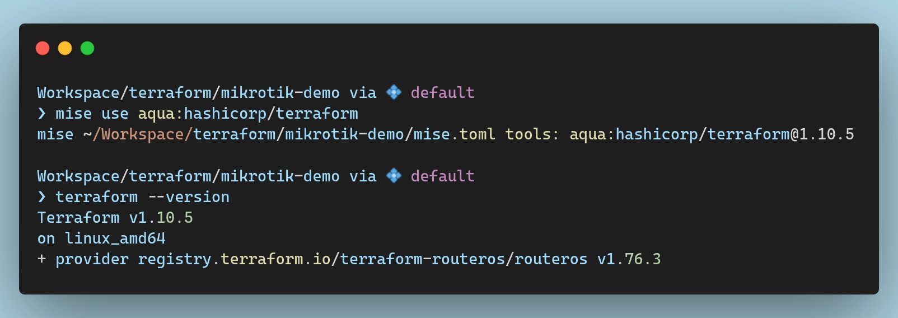
  _Installing terraform via `mise`_

## Connecting Terraform to Mikrotik

### Provider Setup

The provider I'm going to use is [terraform-routeros](https://registry.terraform.io/providers/terraform-routeros/routeros/latest). I will install the latest version which, at the time of writing, is `1.76.3`. To do that, I typically create a `providers.tf` file in the root of my project and configure the `required_providers` block there:

```terraform {file="provider.tf"}
terraform {
  required_providers {
    routeros = {
      source  = "terraform-routeros/routeros"
      version = "1.76.3"
    }
  }
}
```

With that in place, I can now initialize the workspace to pull down the provider and install it:

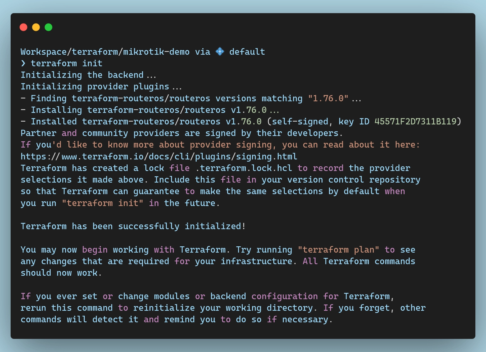
_Initializing the Terraform workspace_

### Provider Configuration

> By default, Mikrotik routers use an IP of `192.168.88.1` and a username of `admin`.
> Depending on your model, the password *might* be blank or it *might* be randomized. If it's blank, well... you'll know. If it's randomized, it will be written on your device, on the label next to the serial number and whatnot.
{.prompt-info}

With the provider installed, I need to configure it to tell it how it can connect to my router to manage it. It needs to know the IP address and the credentials to authenticate against the RouterOS API.

This is done by adding a `provider` block with the required parameters which you can find in the [official documentation](https://registry.terraform.io/providers/terraform-routeros/routeros/latest/docs#example-usage) of the provider. I typically dump that config in my `providers.tf` file as well:

```terraform {file="providerss.tf"}
# ...
provider "routeros" {
  hosturl  = var.mikrotik_host_url
  username = var.mikrotik_username
  password = var.mikrotik_password
  insecure = var.mikrotik_insecure
}
```

You can see here that I defined variables for all these connection parameters instead of hardcoding them in. You *can* do that if you want to (put your credentials in there), but I don't really recommend to, especially if you intend to push this code to git eventually.  
To be able to use these variables, I need to first define them:

```terraform {file="variables.tf"}
variable "mikrotik_host_url" {
  type        = string
  sensitive   = false
  description = "The URL of the MikroTik device."
}

variable "mikrotik_username" {
  type        = string
  sensitive   = true
  description = "The username for accessing the MikroTik device."
}

variable "mikrotik_password" {
  type        = string
  sensitive   = true
  description = "The password for accessing the MikroTik device."
}

variable "mikrotik_insecure" {
  type        = bool
  default     = true
  description = "Whether to allow insecure connections to the MikroTik device."
}
```

And now I need to tell terraform what the values for these variables actually are. I typically create a `credentials.auto.tfvars` file and make sure to `gitignore` it:

```terraform {file="credentials.auto.tfvars"}
mikrotik_host_url = "https://192.168.88.1"
mikrotik_username = "terraform"
mikrotik_password = "terr4f0rm"
mikrotik_insecure = true
```

> While you can continue using the `admin` user, it is best practice to log in and create a dedicated user for terraform.
{.prompt-tip}

### Validating the Connection

At this point everything should be all set up and ready to go... Or so I thought.

I'll first create a dummy resource, say a test file, to make sure commands are sent properly to the RouterOS API:

```terraform
resource "routeros_file" "test" {
  name     = "test"
  contents = "This is a test"
}
```

With all this in place, I should be able to run `terraform apply` and see some successful output, right?

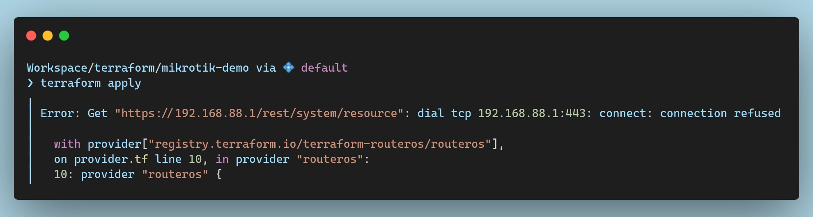
_`terraform apply` failure_

I'll spare you the details and the troubleshooting time. It's certificates... It's always certificates... Unless it's DNS, of course, but if it's not DNS it's definitely certificates 😅

### RouterOS Setup

Terraform connects to my router via the API, which is the `www-ssl` service. Not to be confounded with the `api` or `api-ssl` services. No no no no no. Those are, as far as I understand, the older versions of the API and `www-ssl` is the newer REST API implementation which we need.

Thus, before Terraform can connect to my router, I need to ensure that the `www-ssl` service is properly configured. By default, RouterOS doesn't enable it and, more importantly, it doesn't bind a certificate to it. The solution is simple, then. I just need to:

1. Create a self-signed certificate authority
2. Generate a certificate for the web interface
3. Bind that certificate to the `www-ssl` service
4. Enable the service
5. Profit???

Long story short, here are the commands I needed to run on my router to set all these up:

```sh
# Create a local root certificate
[admin@MikroTik] > /certificate/add name=local-root-cert common-name=local-cert key-size=prime256v1 key-usage=key-cert-sign,crl-sign trusted=yes

# Sign the root certificate
[admin@MikroTik] > /certificate/sign local-root-cert

 progress: done

# Create a certificate for the web interface
[admin@MikroTik] > /certificate/add name=webfig common-name=192.168.88.1 country=RO locality=BUC organization=MIRCEANTON unit=HOME days-valid=3650 key-size=prime256v1 key-usage=key-cert-sign,crl-sign,digital-signature,key-agreement,tls-server trusted=yes

# Sign the web interface certificate using our local CA
[admin@MikroTik] > /certificate/sign ca=local-root-cert webfig

 progress: done

# Bind the certificate to the www-ssl service and configure it
[admin@MikroTik] > /ip/service/set www-ssl certificate=webfig disabled=no

# Enable the www-ssl service
[admin@MikroTik] > /ip/service/enable www-ssl
```

I don't actually recommend copy-pasting these commands as they are rather specific to my setup. You can see the `organization` I set to `mirceanton` and so on. Take the extra 30 seconds to customize these commands to suit your setup before running them!

Also, since we're using a self-signed certificate, you'll need to set `insecure = true` in your Terraform provider configuration, if you haven't done that already.

### Validating the Connection (again)

At this point everything should be all set up and ready to go. For real this time! To test that, I will run `terraform plan` once again:

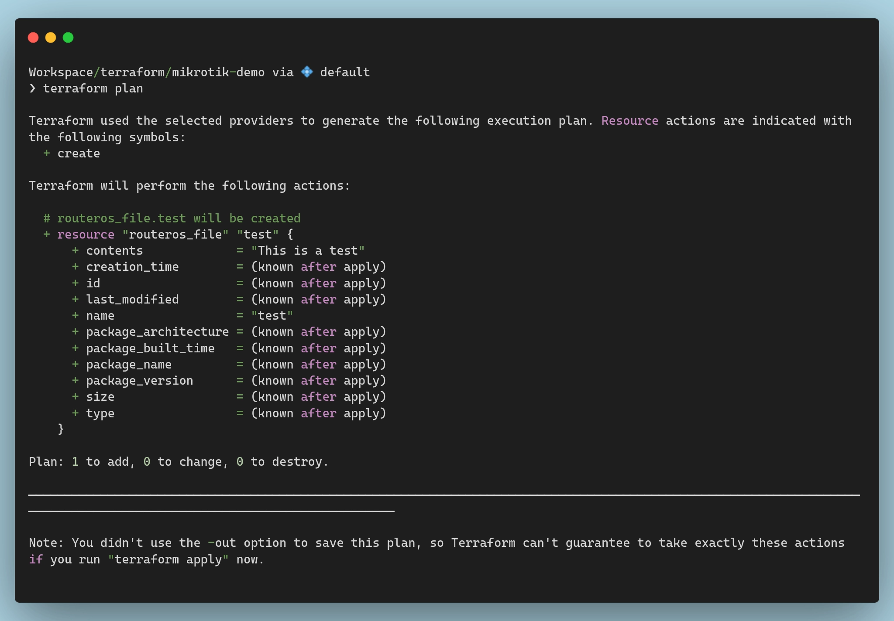
_`terraform plan` fixed_

If you see output similar to the above, then it means terraform has successfully connected to your Mikrotik device, and you're ready to move on to the next steps!

## Importing the Default Config

When bringing a MikroTik device under Terraform management, you pretty much have two options:

1. Reset the router and build from scratch,
2. Import the existing configuration into Terraform

Each option has pros and cons, and I'm not really going to debate which is better and why.

The former option, at least in terms of the procedure, is simpler. You just reset the device (assuming it's not already at factory settings) and start terraforming right away. The downside is that you either have to do things in a very specific order since resetting your device will cut off your internet access which you might need to download providers or in case you are using a remote state backend. But hey... at least you don't have to bother with `terraform import`-ing a lot of resources.

The latter is a bit more involved, since you have to create matching/equivalent terraform resources for every bit of configuration that comes in the default config and then fetch their IDs from the device to import them.

That being said, I'll go for the second option so that I don't have to battle configuring my router at the same time as I am battling managing it via terraform. To be honest, I am fairly new to mikrotik devices in general, so I want to take it one step at a time. I want to onboard the default configuration and get a feeling for managing this router via terraform and I can get fancy with the config later on.

For now, let's start importing the default configuration that came with my RB5009. While I won't drop the entire `export` here, I did save it in [a gist](https://gist.github.com/mircea-pavel-anton/11852c0978c974d36ce0e28945878ef8) if you're interested.

### Certificate

Let's start off by importing the certificates we created earlier. Creating them with terraform looks something like this:

```terraform {file="certificates.tf"}
resource "routeros_system_certificate" "local-root-ca-cert" {
  name        = "local-root-cert"
  common_name = "local-cert"
  key_size    = "prime256v1"
  key_usage   = ["key-cert-sign", "crl-sign"]
  trusted     = true
  sign {}

  lifecycle { ignore_changes = [ sign ] }
}

resource "routeros_system_certificate" "webfig" {
  name        = "webfig"
  common_name = "192.168.88.1"

  country      = "RO"
  locality     = "BUC"
  organization = "MIRCEANTON"
  unit         = "HOME"
  days_valid   = 3650

  key_usage = ["key-cert-sign", "crl-sign", "digital-signature", "key-agreement", "tls-server"]
  key_size  = "prime256v1"

  trusted = true
  sign { ca = routeros_system_certificate.local-root-ca-cert.name }

  lifecycle { ignore_changes = [ sign ] }
}
```

There are a couple of things to note here.

First off, we're specifically ignoring changes to the `sign` status of the resources via the `lifecycle` block to avoid deleting and re-creating the certificates after the import.

Secondly, while we're specifying that the `local-root-cert` is signed with no extra config, we are explicitly stating that `webfig` is signed with `local-root-cert` as the CA.

If I were to apply this right now, however, the operation would fail. Terraform would send the request to the ROS API to create 2 new certificates and RouterOS will complain saying that they already exist.

To fix that, I need to *import* them into my state. This can be done either manually by running a `terraform import` command, or by adding an `import` block in my terraform config.

Regardless of which option I choose, I firstly need to get the IDs of the certs.

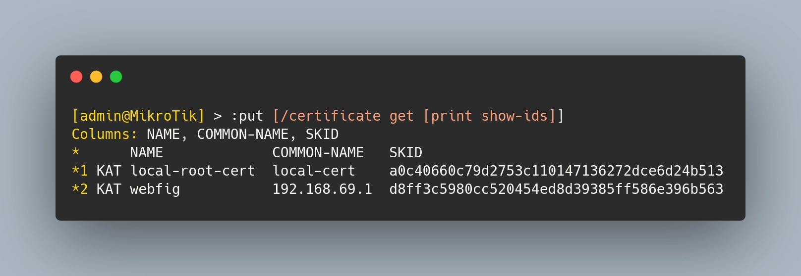
_Certificate resource ID_

From this output, we can see that `local-root-cert` has an ID of `*1` and `webfig` is `*2` (the "*" is actually required). To import them, I will add the following `import` blocks to my `certificates.tf` file:

```bash {file="certificates.tf"}
import {
  to = routeros_system_certificate.local-root-ca-cert
  id = "*1"
}
import {
  to = routeros_system_certificate.webfig
  id = "*2"
}
```

Almost every resource we create today will have to be imported since we are trying to take over the default configuration. From now on, to keep things a bit more concise, I will add the command to get the resource ID from Mikrotik in the initial code snippet and then add an `import` block in all my terraform configs.

This will make sure that I can just `terraform apply` my code and it will automatically import all of the resources and update them if needed.

### IP Services

Getting the services sorted out was, surprisingly, very simple. The official documentation has the [perfect example](https://registry.terraform.io/providers/terraform-routeros/routeros/latest/docs/resources/ip_service#example-usage) listed so all I really had to do was to copy-paste it into my config and make some small adjustments:

```terraform {file="ip-services.tf"}
resource "routeros_ip_service" "disabled" {
  for_each = { "api" = 8728, "ftp" = 21, "telnet" = 23, "www" = 80, "ssh" = 22 }
  numbers  = each.key
  port     = each.value
  disabled = true
}
resource "routeros_ip_service" "enabled" {
  for_each = { "winbox" = 8291 }
  numbers  = each.key
  port     = each.value
  disabled = false
}
resource "routeros_ip_service" "ssl" {
  for_each    = { "api-ssl" = 8729, "www-ssl" = 443 }
  numbers     = each.key
  port        = each.value
  tls_version = "only-1.2"
  certificate = routeros_system_certificate.webfig.name
}
```

With this, I am making sure that all of the services I *don't* need are disabled, and, most importantly, all of the services that need TLS have the webfig certificate bound to them.

These resources don't actually need to be imported, so there's nothing else to do here. We can safely apply this config and move on with our lives.

### Bridge Interface

By default, Mikrotik creates **one bridge interface per switch chip** in your device. As far as I understand, this is due to performance optimizations since only one bridge per switch chip can take advantage of hardware acceleration.

There's nothing stopping you from creating more, just know that it will likely perform poorly since traffic between them will be processed by the CPU instead of the switch chip.

Since my RB5009 has only one switch chip, it has one default bridge called... well... `bridge` 😅.

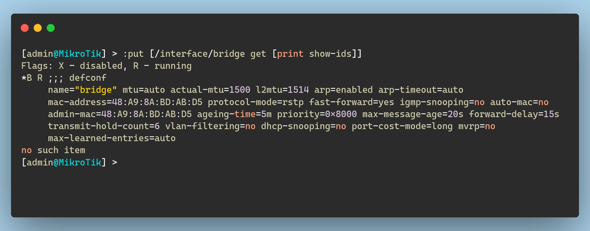
_Bridge Interface resource ID_

I can define this bridge as a terraform resource like so (note that I don't include the "defconf" comments):

```terraform {file="bridge.tf"}
resource "routeros_interface_bridge" "bridge" {
  name           = "bridge"
  admin_mac      = "48:A9:8A:BD:AB:D5"
}
```

### Bridge Ports

With the bridge imported, I can now move on to the bridge ports. Typically, one interface will be dedicated as a WAN port (in my case `ether1`), and then all other interfaces will be added to this bridge as part of the LAN network:

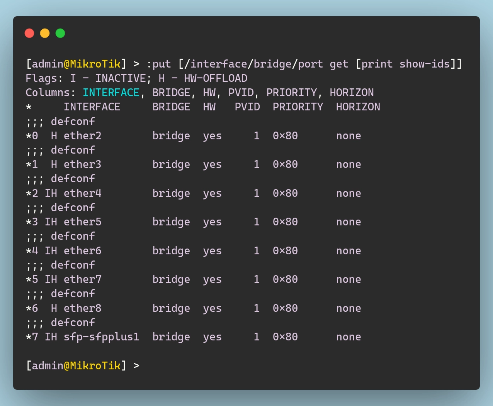
_Bridge Port resource IDs_

In terraform terms, we can bundle together all bridge ports into a single resource with a `for_each` block to keep things a bit cleaner, both for the `import` part and for the actual resource definition:

```terraform {file="bridge.tf"}
import {
  for_each = {
    "ether2"       = { id = "*0" }
    "ether3"       = { id = "*1" }
    "ether4"       = { id = "*2" }
    "ether5"       = { id = "*3" }
    "ether6"       = { id = "*4" }
    "ether7"       = { id = "*5" }
    "ether8"       = { id = "*6" }
    "sfp-sfpplus1" = { id = "*7" }
  }
  to = routeros_interface_bridge_port.bridge_ports[each.key]
  id = each.value.id
}
resource "routeros_interface_bridge_port" "bridge_ports" {
  for_each = {
    "ether2"       = { comment = "", pvid = "1" }
    "ether3"       = { comment = "", pvid = "1" }
    "ether4"       = { comment = "", pvid = "1" }
    "ether5"       = { comment = "", pvid = "1" }
    "ether6"       = { comment = "", pvid = "1" }
    "ether7"       = { comment = "", pvid = "1" }
    "ether8"       = { comment = "", pvid = "1" }
    "sfp-sfpplus1" = { comment = "", pvid = "1" }
  }
  bridge    = routeros_interface_bridge.bridge.name
  interface = each.key
  comment   = each.value.comment
  pvid      = each.value.pvid
}
```

### IP Addresses

By default, a Mikrotik router comes configured with two IP settings:

1. **Static LAN IP:**
   This is the IP address used by devices on the local network. In my default configuration, the router assigns the LAN interface a static IP of `192.168.88.1/24` via the bridge.

2. **Dynamic WAN IP (DHCP Client):**
   For external connectivity, the router typically obtains a dynamic IP address on the WAN interface through DHCP. In my particular case this won't actually work, as I am not using DHCP, but we'll cross that bridge when we get to it.

The IDs for the resources can be exported using the following commands:

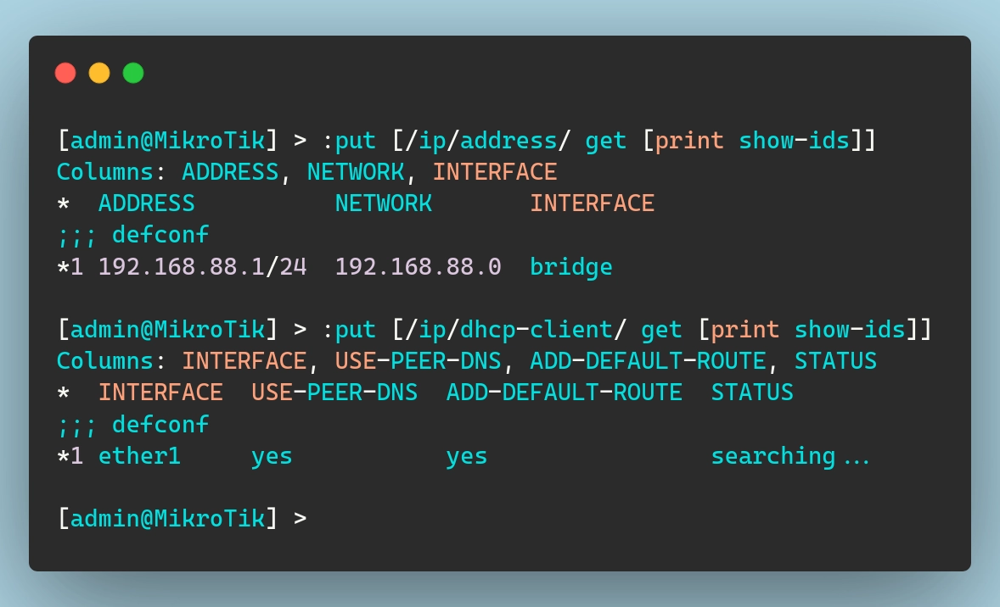
_IP Addresses resource IDs_

And then we can create the resources in terraform and import them like so:

```terraform {file="ip-address.tf"}
import {
  to = routeros_ip_address.lan
  id = "*1"
}
resource "routeros_ip_address" "lan" {
  address   = "192.168.88.1/24"
  interface = routeros_interface_bridge.bridge.name
  network   = "192.168.88.0"
}

import {
  to = routeros_ip_dhcp_client.wan
  id = "*1"
}
resource "routeros_ip_dhcp_client" "wan" {
  interface = "ether1"
}
```


### DHCP Server

Mikrotik routers come pre-configured with a DHCP server on the LAN network so that devices connecting to them automatically receive an IP address. This setup is composed of three elements:

1. **IP Pool:**
   This defines the range of IP addresses that the DHCP server can assign to clients. In my default setup, the pool covers addresses from `192.168.88.10` to `192.168.88.254`.

2. **DHCP Server Network:**
   This resource specifies the network details to be handed out to DHCP clients such as the network address, gateway, and DNS server.

3. **DHCP Server:**
   This is the actual service that listens on the designated interface (in this case, the bridge) and assigns IP addresses from the defined pool.

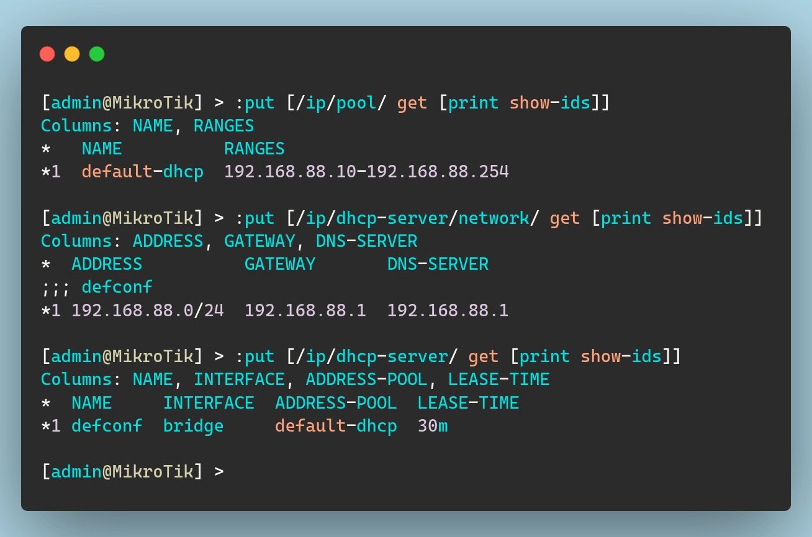
_DHCP-Server related resource IDs_

Below is how you can mirror this setup in Terraform:

```terraform {file="dhcp-server.tf"}
import {
    to = routeros_ip_pool.dhcp
    id = "*1"
}
resource "routeros_ip_pool" "dhcp" {
  name   = "default-dhcp"
  ranges = ["192.168.88.10-192.168.88.254"]
}

import {
    to = routeros_ip_dhcp_server_network.dhcp
    id = "*1"
}
resource "routeros_ip_dhcp_server_network" "dhcp" {
  address    = "192.168.88.0/24"
  gateway    = "192.168.88.1"
  dns_server = ["192.168.88.1"]
}

import {
    to = routeros_ip_dhcp_server.defconf
    id = "*1"
}
resource "routeros_ip_dhcp_server" "defconf" {
  name         = "defconf"
  address_pool = routeros_ip_pool.dhcp.name
  interface    = routeros_interface_bridge.bridge.name
}
```

### DNS

Mikrotik routers include a built-in DNS server by default, allowing network clients to resolve domain names without needing an external DNS resolver. Additionally, a static DNS entry (router.lan) is created so that the router itself can be easily referenced within the LAN.

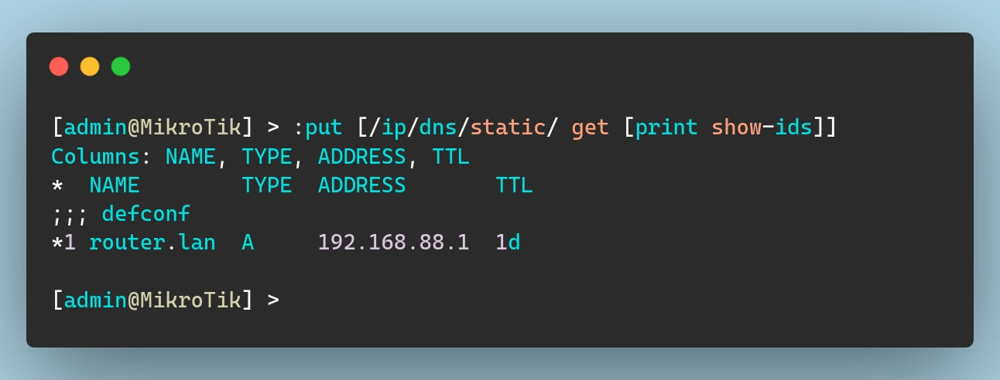
_Static DNS Entry resource IDs_

To mirror that in terraform, we need the following:

```terraform {file="dns.tf"}
resource "routeros_dns" "dns-server" {
  allow_remote_requests = true
  servers = [ "1.1.1.1", "8.8.8.8" ]
}

import {
  to = routeros_ip_dns_record.defconf
  id = "*1"
}
resource "routeros_ip_dns_record" "defconf" {
  name    = "router.lan"
  address = "192.168.88.1"
  type    = "A"
}
```

Note that here I am specifying the upstream dns servers as `1.1.1.1` and `8.8.8.8`. I *think* that by default Mikrotik uses the values it receives via DHCP on the WAN interface.

### Interface Lists

Mikrotik routers use **interface lists** to group interfaces together for easier management. These lists are particularly useful when applying firewall rules, routing configurations, and other network policies.

By default, Mikrotik creates two interface lists:

1. **WAN:** Represents the external (internet-facing) interfaces
2. **LAN:** Represents the internal (local network) interfaces

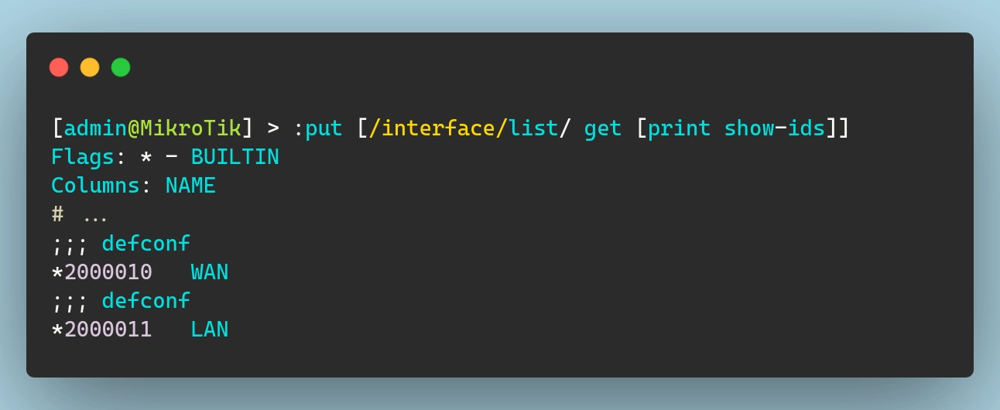
_Interface List resource ID_

To replicate this setup in Terraform, we need to define the interface lists like so:

```terraform {file="firewall.tf"}
import {
  to = routeros_interface_list.wan
  id = "*2000010"
}
resource "routeros_interface_list" "wan" { name = "WAN" }

import {
  to = routeros_interface_list.lan
  id = "*2000011"
}
resource "routeros_interface_list" "lan" { name = "LAN" }
```

Additionally, interfaces are assigned to these lists as follows:

- The **bridge** interface (which includes LAN ports) is added to the `LAN` list.
- The **ether1** interface (usually the WAN port) is added to the `WAN` list.

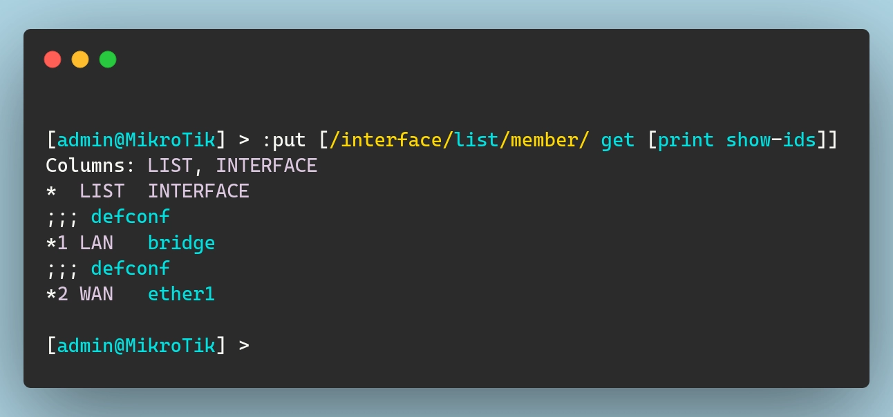
_Interface List Member resource ID_

```terraform {file="firewall.tf"}
import {
  to = routeros_interface_list_member.wan_ether1
  id = "*2"
}
resource "routeros_interface_list_member" "wan_ether1" {
  interface = "ether1"
  list      = routeros_interface_list.wan.name
}

import {
  to = routeros_interface_list_member.lan_bridge
  id = "*1"
}
resource "routeros_interface_list_member" "lan_bridge" {
  interface = routeros_interface_bridge.bridge.name
  list      = routeros_interface_list.lan.name
}
```

These interface lists are particularly useful when configuring **firewall rules**. Instead of applying rules to individual interfaces, we can apply them to entire groups. This makes managing network security and policies much easier.

### IPv4 Firewall

Speaking of the devil, let's talk about firewall rules now. For the sake of keeping this post within a reasonable length (and also to hopefully hide my noob-ness), I won't go into detail about the default firewall ruleset.

All I'm going to say here is that firewall rules are applied from the top down. This means that, when you read the list starting from the top, if traffic matches one of the rules it will get filtered accordingly. If it does not, it keeps going down the list until it either finds a match or it reaches the end.

If it reaches the end without finding a match, mikrotik has, for whatever reason, a **default allow** policy in place. This means that having no firewall rules will actually leave you wide open instead of completely blocked, as would be the case with other firewalls.

With that being said, here is the default ruleset for IPv4:

```sh
/ip firewall filter
add action=accept chain=input comment="defconf: accept established,related,untracked" connection-state=established,related,untracked
add action=drop chain=input comment="defconf: drop invalid" connection-state=invalid
add action=accept chain=input comment="defconf: accept ICMP" protocol=icmp
add action=accept chain=input comment="defconf: accept to local loopback (for CAPsMAN)" dst-address=127.0.0.1
add action=drop chain=input comment="defconf: drop all not coming from LAN" in-interface-list=!LAN
add action=accept chain=forward comment="defconf: accept in ipsec policy" ipsec-policy=in,ipsec
add action=accept chain=forward comment="defconf: accept out ipsec policy" ipsec-policy=out,ipsec
add action=fasttrack-connection chain=forward comment="defconf: fasttrack" connection-state=established,related hw-offload=yes
add action=accept chain=forward comment="defconf: accept established,related, untracked" connection-state=established,related,untracked
add action=drop chain=forward comment="defconf: drop invalid" connection-state=invalid
add action=drop chain=forward comment="defconf: drop all from WAN not DSTNATed" connection-nat-state=!dstnat connection-state=new in-interface-list=WAN
```

Importing all of this into terraform would be pretty annoying given that each rule would be an individual resource. Given that I currently don't have internet connectivity anyway, it will be much quicker and easier to just delete all firewall rules and then re-create them from terraform.

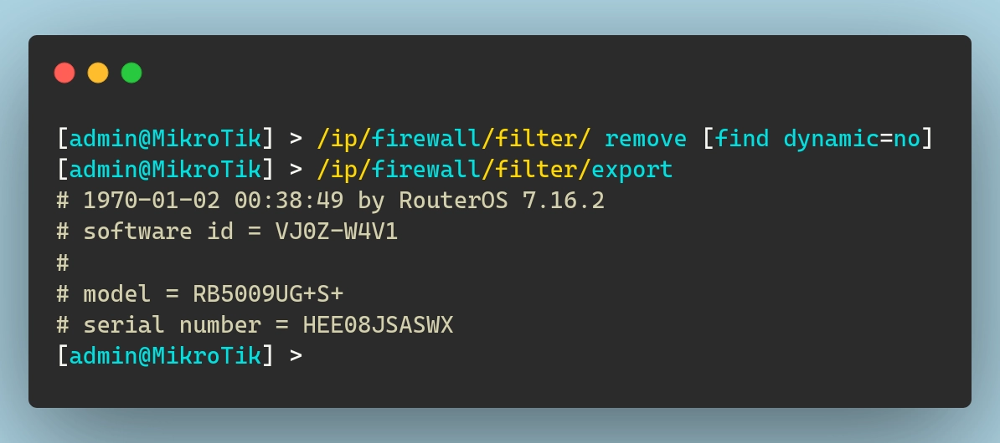
_Deleting all IPv4 firewall rules_

And now to re-create them all in terraform, we need to add the following code to our `firewall.tf` file:

```terraform {file="firewall.tf"}
resource "routeros_ip_firewall_filter" "accept_established_related_untracked" {
  action           = "accept"
  chain            = "input"
  comment          = "accept established, related, untracked"
  connection_state = "established,related,untracked"
  place_before     = routeros_ip_firewall_filter.drop_invalid.id
}
resource "routeros_ip_firewall_filter" "drop_invalid" {
  action           = "drop"
  chain            = "input"
  comment          = "drop invalid"
  connection_state = "invalid"
  place_before     = routeros_ip_firewall_filter.accept_icmp.id
}
resource "routeros_ip_firewall_filter" "accept_icmp" {
  action       = "accept"
  chain        = "input"
  comment      = "accept ICMP"
  protocol     = "icmp"
  place_before = routeros_ip_firewall_filter.capsman_accept_local_loopback.id
}
resource "routeros_ip_firewall_filter" "capsman_accept_local_loopback" {
  action       = "accept"
  chain        = "input"
  comment      = "accept to local loopback for capsman"
  dst_address  = "127.0.0.1"
  place_before = routeros_ip_firewall_filter.drop_all_not_lan.id
}
resource "routeros_ip_firewall_filter" "drop_all_not_lan" {
  action            = "drop"
  chain             = "input"
  comment           = "drop all not coming from LAN"
  in_interface_list = "!LAN"
  place_before      = routeros_ip_firewall_filter.accept_ipsec_policy_in.id
}
resource "routeros_ip_firewall_filter" "accept_ipsec_policy_in" {
  action       = "accept"
  chain        = "forward"
  comment      = "accept in ipsec policy"
  ipsec_policy = "in,ipsec"
  place_before = routeros_ip_firewall_filter.accept_ipsec_policy_out.id
}
resource "routeros_ip_firewall_filter" "accept_ipsec_policy_out" {
  action       = "accept"
  chain        = "forward"
  comment      = "accept out ipsec policy"
  ipsec_policy = "out,ipsec"
  place_before = routeros_ip_firewall_filter.fasttrack_connection.id
}
resource "routeros_ip_firewall_filter" "fasttrack_connection" {
  action           = "fasttrack-connection"
  chain            = "forward"
  comment          = "fasttrack"
  connection_state = "established,related"
  hw_offload       = "true"
  place_before     = routeros_ip_firewall_filter.accept_established_related_untracked_forward.id
}
resource "routeros_ip_firewall_filter" "accept_established_related_untracked_forward" {
  action           = "accept"
  chain            = "forward"
  comment          = "accept established, related, untracked"
  connection_state = "established,related,untracked"
  place_before     = routeros_ip_firewall_filter.drop_invalid_forward.id
}
resource "routeros_ip_firewall_filter" "drop_invalid_forward" {
  action           = "drop"
  chain            = "forward"
  comment          = "drop invalid"
  connection_state = "invalid"
  place_before     = routeros_ip_firewall_filter.drop_all_wan_not_dstnat.id
}
resource "routeros_ip_firewall_filter" "drop_all_wan_not_dstnat" {
  action               = "drop"
  chain                = "forward"
  comment              = "drop all from WAN not DSTNATed"
  connection_nat_state = "!dstnat"
  connection_state     = "new"
  in_interface_list    = "WAN"
}
```

> Note that, since ordering is important, we do have the `place_before` argument for each rule to ensure they end up in the correct order.
{.prompt-info}

There probably is a way to make this code more efficient/clean using a loop block or a similar approach. Given how critical firewall rules are, however, and especially given the risk of locking myself out due to misconfigurations, I’ve decided to keep things dumb and define each rule as a separate resource.

### NAT Configuration

Mikrotik routers use **NAT (Network Address Translation)** to allow devices on the internal network (LAN) to access the internet through the WAN interface. This is done using a **masquerade** rule, which dynamically translates private IP addresses into the router's public IP:

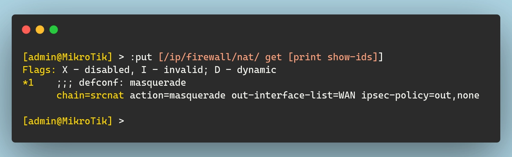
_Firewall NAT resource ID_

To replicate this setup in Terraform, define the resource:

```terraform {file="firewall.tf"}
import {
  to = routeros_ip_firewall_nat.masquerade
  id = "*1"
}
resource "routeros_ip_firewall_nat" "masquerade" {
  chain              = "srcnat"
  action             = "masquerade"
  ipsec_policy       = "out,none"
  out_interface_list = routeros_interface_list.wan.name
}
```

### IPv6 Rules (or Lack Thereof)

You might be expecting some detailed IPv6 firewall configurations here. I am, however, going to keep this section short. I'm fully aware that some might not agree with this approach, but here we go...

Simply put, I don’t use IPv6 in my network. I have no need for it at the moment, and I don’t want to complicate things by introducing it needlessly into my setup. I may change my mind and explore it in the future, but I’m not going to bother with it right now.

With that in mind (and with the comment section now full of angry people), the solution here is simple. I’ve decided to disable IPv6 entirely. 😅

```terraform {file="ipv6.tf"}
resource "routeros_ipv6_settings" "disable" {
  disable_ipv6 = "true"
}
```

### Miscellaneous Configurations

The default config includes a few additional settings that control network discovery and administrative access. These settings ensure that **only devices within the LAN** can discover and manage the router.

1. **Neighbor Discovery** → Only devices in the LAN can see the router via Mikrotik’s **Neighbor Discovery Protocol (MNDP)**.
2. **MAC Server** → Restricts access to the router's MAC-based login services (used for debugging and management).
3. **Winbox MAC Access** → Limits MAC-based access via **Winbox** (Mikrotik’s GUI management tool) to LAN devices.

```sh
/ip neighbor discovery-settings set discover-interface-list=LAN
/tool mac-server set allowed-interface-list=LAN
/tool mac-server mac-winbox set allowed-interface-list=LAN
```

To mirror these settings in Terraform:

```terraform {file="misc.tf"}
resource "routeros_ip_neighbor_discovery_settings" "lan_discovery" {
  discover_interface_list = routeros_interface_list.lan.name
}
resource "routeros_tool_mac_server" "mac_server" {
  allowed_interface_list = routeros_interface_list.lan.name
}
resource "routeros_tool_mac_server_winbox" "winbox_mac_access" {
  allowed_interface_list = routeros_interface_list.lan.name
}
```

For a nice change of scenery here, these resources don't need to be imported. We can simply create them and the ROS API will modify the config as needed.

## Modifying the Default Config

I mentioned in the introduction of this blog post that I want to make as few changes as possible to the default config in order to get internet access. Well... I lied. I am also going to make 2 additions to this configuration that are not strictly speaking required but are things I typically do on any machine once I start managing it.

### Basic System Settings

Setting the hostname, or identity, as Mikrotik calls it, and the timezone of a machine are basic things I do every single time I get a new computer in my lab. Fortunately, the RouterOS API exposes these settings and the terraform provider implements them. I will set my hostname to `Router` (very clever, I know 😉) and the timezone to `Europe/Bucharest`:

```tf {file="system.tf"}
resource "routeros_system_identity" "identity" { name = "Router" }
resource "routeros_system_clock" "timezone" {
  time_zone_name       = "Europe/Bucharest"
  time_zone_autodetect = false
}
```

### PPPoE Config

I mentioned a couple of time throughout this process that the default DHCP client on the WAN does not work for me. This is because my ISP uses PPPoE to assign me an IP address.

This means that in order to get an IP address and be able to access the internet I need to:

1. **Remove DHCP Client**,
2. **Create a PPPoE Client Interface** (with credentials),
3. **Add PPPoE to the WAN interface list**.

The first step is rather easy. Assuming I delete the code for the DHCP client, terraform will simply remove that config from my router on the next `apply` command.

As for the second step, I need to create a PPPoE client and configure it to use my credentials. Just as I did when I had to specify my ROS credentials, I will configure my username and password as variables like so:

```terraform {file="variables.tf"}
# ...
variable "digi_pppoe_username" {
  type        = string
  sensitive   = true
  description = "The PPPoE username for the Digi connection."
}
variable "digi_pppoe_password" {
  type        = string
  sensitive   = true
  description = "The PPPoE password for the Digi connection."
}
```

Now I can add them to my `credentials.auto.tfvars` file I mentioned previously and reference them in the actual terraform resource. Also, I want to make sure to add this pppoe interface to my "WAN" interface list. This ensures that my firewall and NAT rules still apply to the new WAN connection:

```terraform {file="pppoe.tf"}
resource "routeros_interface_pppoe_client" "digi" {
  interface         = "ether1"
  name              = "PPPoE-Digi"
  add_default_route = true
  use_peer_dns      = false
  password          = var.digi_pppoe_password
  user              = var.digi_pppoe_username
}

resource "routeros_interface_list_member" "pppoe_wan" {
  interface = routeros_interface_pppoe_client.digi.name
  list      = routeros_interface_list.wan.name
}
```

## Wrapping Up

At this point, I think I covered the basics and set up a fully functional, automated MikroTik configuration using Terraform. I can access the internet again and all of my config is defined as code. Let's run one glorious `terraform apply` command to see all resources being imported/created and/or updated:


