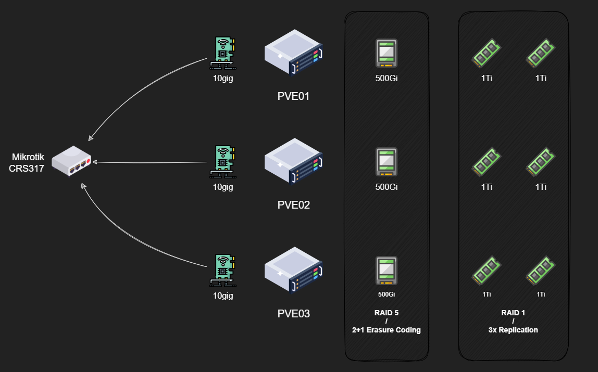

If you're following along with my homelab journey, either here or on the [YouTubez](https://www.youtube.com/@mirceanton), you might know that a few weeks ago I got a new three-node Proxmox cluster up and running.

It's been great for compute, no complaints there. If a node dies, VMs can restart elsewhere. But only if they were using my NAS for storage.

Any VMs on local storage? Toast if that node dies. VMs on my NAS? Great until the NAS decides to take a nap. Either way, I've got single points of failure everywhere, and calling this "highly available" feels like I'm lying to myself.

Clustered compute is only half the equation. To actually achieve high availability, I need clustered storage too. Running both on the same hardware is what people call "hyperconverged infrastructure" or HCI, which sounds way fancier than "I'm using all my hardware for everything."

Enter Ceph. After weeks of reading documentation, breaking things, and questioning my life choices, I finally got it working. Let me walk you through what I learned.

## Ceph in 30 seconds: What's the big deal?

So, what is this Ceph thing anyway? The official definition is a "distributed, software-defined, clustered storage system," which is a mouthful that didn't mean much to me at first.

Let's use an analogy. You're probably familiar with **RAID**. You put a bunch of disks in a single server (like a NAS) and use something like ZFS or `mdadm` to make them act as one big, redundant pool. Your data gets spread out so you can lose a disk (or a few) without losing your data.

**Ceph does the same thing, but for your entire fleet of servers**.

Instead of being limited to the disks in one box, Ceph pools disks across multiple machines. It's like RAID, but at the cluster level. This has some amazing benefits:

- **Hardware flexibility**: Unlike ZFS which can be picky about drive sizes, Ceph handles mismatched hardware pretty gracefully. Ceph assigns a weight to each drive based on its capacity and makes full use of every last bit you give it!
- **Horizontal scaling**: Similar to Kubernetes, Ceph splits functionality into separate services that can be scaled independently. Need more performance? Add more nodes or disks. It's designed for this.
- **Software-defined**: You throw hardware at it and configure everything in software. No complex hardware RAID controllers or special cabling. You could theoretically have Raspberry Pis with USB drives alongside enterprise servers with NVMe SSDs all in the same cluster. (Please don't actually do this.)

For me, this means that I can easily live-migrate VMs between nodes or shut them down for maintenance without my cluster breaking a sweat.

## The Master Plan



My cluster consists of three identical Proxmox nodes: `pve01`, `pve02`, `pve03`, each rocking:

- **CPU**: Ryzen 7 5700G
- **RAM**: 64GiB 2666Mhz DDR4
- **Networking**: Dual 10Gbps NICs in an LACP bond
- **Storage**:
  - **boot disk**: 1x 240GiB NVMe SSD in a PCIe x1 carrier board
  - **data disk**: 1x 500GiB SATA SSD
  - **data disk**: 2x 1TB NVMe SSD

Now, here's where things get interesting. I want to create two distinct pools:

1. **NVMe Replicated Pool**: Using all six NVMe drives with 3x replication. Any data I write gets copied to all three nodes. Maximum performance and redundancy for VM disks. The downside? I'm paying for 6TB of capacity but only get 2TB usable.

2. **SATA Erasure-Coded Pool**: Using the three SATA SSDs in a 2+1 configuration. This is conceptually similar to RAID5, so data gets split into chunks with parity. I can lose one drive and still reconstruct everything. Much more space-efficient but slower due to parity calculations.

And yes, I know what you're thinking: "Isn't Ceph good at handling mismatched drives? Why not throw everything in one pool?"

Same reason you don't put your OS and data on the same RAID array. Different performance characteristics, different use cases. NVMe for VM disks where IOPS matter, SATA for ISOs and backups where capacity matters more.

## Getting Ceph Up and Running

I'll be doing this entire setup via the command line. While Proxmox has a great GUI for this, a blog post with just pictures of "click here and then click there" is not that interesting IMO. Plus, the CLI offers more control and, let's be honest, it's just more fun. 😉

### Getting Started: Installation

First up, I need to install Ceph packages on all three nodes. I'm using Zellij to sync my terminal panes because manually SSH-ing into each node and typing the same command three times sounds like a special kind of torture.

```bash
# Run on ALL nodes
pveceph install --repository=no-subscription --version=squid
```

I'm using Ceph version 19.2 (codenamed Squid). The `--repository=no-subscription` flag uses Proxmox's no-subscription repo since I'm not paying for their enterprise support.

## Bootstrapping the Cluster

With the packages installed, I need to initialize the cluster on one node:

```bash
# Run on ONE node only (e.g., pve01)
pveceph init \
  --cluster-network 10.255.255.0/24 \
  --network 10.255.255.0/24
```

Quick note about those network parameters. Ceph uses two networks:

- **Public network**: For clients to access storage served by Ceph
- **Cluster network**: For internal node-to-node cluster traffic

Ideally, these should be separate physical networks to avoid throughput bottlenecks. Think about it, high traffic on the public network, say a client writing a lot of data to the cluster, will also result in high traffic on the cluster network since the nodes have to replicate that data across the cluster. If both the client and the cluster are using the same wire, well they're going to be competing for those bps.

In my case? I am actually using a dedicated "storage" network for this. I couldn't think of another more fitting name. Basically, besides the Ceph traffic, each node has an IP on this network, and any VM that needs access to my NAS gets one too.

All of that traffic is going over the same 10Gbps bond because I'm running a homelab, not a datacenter. Will this bite me later? Maybe. Am I going to do it anyway? Absolutely.

Now, one thing about this command is that even though it does sound like we initialized the cluster, we didn't really do anything of the sort. What this does, as far as I can tell, is that it generates some configuration files for the Ceph services later on, but it doesn't actually start any of them.

## Setting Up the Management Layer

Now for the fun part: configuring all the services that make Ceph actually work.

We already established that Ceph splits roles in the cluster to dedicated services/processes. Just like I would need to set up the controlplane services in a Kube cluster before doing any `kubectl apply`, so do I need to set up the Ceph "management" services before I can `ceph osd pool create`. Same concept, really.

### Monitors

Monitors are the first Ceph service you will run into. You cannot have a cluster without monitors. They maintain the cluster map, which is a fancy way of saying that they keep track of everything going on in the cluster. Where are all the services? Which disks are where? What's the topology? It's all tracked here.

To keep the Kube analogies going (let me know in the comments if they are actually helpful or not), in my mind these are kind of like the etcd in a Kubernetes cluster. They store all of the information about the state of the cluster for the other components to use, but they don't necessarily do something with that information themselves.

These use a consensus algorithm to establish quorum and maintain data integrity. Practically speaking, this means that you need an odd number of nodes to maintain a healthy cluster and prevent [split-brain scenarios](<https://en.wikipedia.org/wiki/Split-brain_(computing)>).

Technically one works, but that's not exactly high availability. Three is the minimum for proper HA. Since I have three nodes in my cluster, I'm going to put a monitor on each

```bash
# Run on ALL nodes
pveceph mon create
```

### Managers

Next up are the Managers. If the Monitors are keeping the cluster's map, the Managers are the ones that push out updates to it and the ones who read that map and report back to you on what's happening.

To keep the Kube analogies rolling, though at this point I am stretching it a bit, I think, if the Monitors are etcd, then the Managers are like the metrics-server and the Kubernetes Dashboard all rolled into one. They don't store the critical state themselves, but they are responsible for gathering all the telemetry, performance metrics, and capacity data from across the cluster.

All of that information is then exposed through user-friendly features like the web-based Ceph Dashboard and a REST API. These are not enabled by default, but rather as add-ons or modules which you can enabled if you want to.

Managers work in an active/standby mode, meaning only one is actively working at any given time while the others wait to take over if it fails. Because of this, you technically only need two for proper HA. However, the documentation recommends running one alongside each of your monitors in a small cluster.

```bash
# Run on ALL nodes
pveceph mgr create
```

### Metadata Servers

Here's where things get conditional. You only need to worry about Metadata Servers (MDS) if you're planning to use CephFS, which is Ceph's native file storage solution.

Think of it this way: with block storage, the filesystem (like `ext4` or `XFS`) lives inside your VM. Ceph just provides the raw, empty blocks and has no idea what you're doing with them. With CephFS, Ceph is the filesystem. That means it needs a dedicated service to track the directory structures, file names, permissions, and all that classic filesystem metadata. The MDS is that service.

Just like the Managers, they work in an active/standby configuration for high availability. While two is technically enough, we've already established a pattern here so I'll be deploying one on each of my three nodes.

```bash
# Run on ALL nodes
pveceph mds create
```

### Cluster Status

At this point, running `ceph --status` should show all services up and running:

- 3 monitors in quorum
- 1 active manager with 2 standbys

```bash
$ ceph --status
cluster:
  id:     ad0e709505e80-4001-868b-f2e23d5c592d
  health: HEALTH_WARN
          OSD count 0 < osd_pool_default_size 3

services:
  mon: 3 daemons, quorum pve01,pve02,pve03 (age 2h)
  mgr: pve01(active, since 2h), standbys: pve02, pve03
  osd: 0 osds: 0 up , 0 in

data:
  pools:   0 pools, 0 pgs
  objects: 0 objects, 0 B
  usage:   0 B used, 0 B / 0 B avail
  pgs:
```

> The metadata servers do not show up in the status command until there is a CephFS pool created in the cluster.  
> They are running but currently inactive. Their status can be checked by verifying the underlying service using the `systemctl status` command.
> {.prompt-info}

At this point, we have the control plane up and running, though it is managing nothing. Time to give it some disks! This is where **Object Storage Daemons (OSDs)** come in.

## Adding Storage: OSDs

OSD stands for Object Storage Daemon. Two important things to understand:

1. **One OSD per physical disk**: Each disk gets its own dedicated process to manage it
2. **They do everything**: Handle data storage, replication to other OSDs, recovery, rebalancing, and health monitoring

For HA, you want at least three OSDs, ideally spread across your cluster. I've got nine total (3 per node).

First, let's see what disks are available:

```bash
root@pve02:~# lsblk
NAME                      MAJ:MIN RM   SIZE RO TYPE MOUNTPOINTS
sda                         8:0    0 465.8G  0 disk
nvme1n1                   259:0    0 238.5G  0 disk
├─nvme1n1p1               259:1    0  1007K  0 part
├─nvme1n1p2               259:2    0   512M  0 part /boot/efi
└─nvme1n1p3               259:3    0 237.5G  0 part
  ├─pve-swap              252:0    0     8G  0 lvm  [SWAP]
  ├─pve-root              252:1    0    96G  0 lvm  /
  ├─pve-data_tmeta        252:2    0   4.9G  0 lvm
  │ └─pve-data            252:4    0 141.2G  0 lvm
  └─pve-data_tdata        252:3    0 141.2G  0 lvm
    └─pve-data            252:4    0 141.2G  0 lvm
nvme0n1                   259:5    0 953.9G  0 disk
nvme2n1                   259:2    0 953.9G  0 disk
```

On each node, I've got (roughly, some of the paths differ across nodes but you get the idea):

- `/dev/nvme0n1` and `/dev/nvme1n1` - my NVMe drives
- `/dev/sda` - my SATA SSD

Creating OSDs is straightforward:

```bash
# Run these commands on EACH node
pveceph osd create /dev/nvme0n1 --crush-device-class nvme
pveceph osd create /dev/nvme1n1 --crush-device-class nvme
pveceph osd create /dev/sda --crush-device-class ssd
```

That `--crush-device-class` flag is important. It labels each OSD by its device type, which I'll use later to tell Ceph "only use NVMe drives for this pool" or "only use SATA SSDs for that pool."

Ceph can auto-detect device classes, but I like being explicit. After creating all OSDs, verify the topology:

```bash
root@pve02:~# ceph osd tree
ID   CLASS  WEIGHT   TYPE NAME       STATUS  REWEIGHT  PRI-AFF
 -1         6.95329  root default
 -3         2.31776      host pve01
  0   nvme  0.93149          osd.0       up   1.00000  1.00000
  1   nvme  0.93149          osd.1       up   1.00000  1.00000
  2    ssd  0.45479          osd.2       up   1.00000  1.00000
 -7         2.31776      host pve02
  3   nvme  0.93149          osd.3       up   1.00000  1.00000
  4   nvme  0.93149          osd.4       up   1.00000  1.00000
  5    ssd  0.45479          osd.5       up   1.00000  1.00000
-10         2.31776      host pve03
  6   nvme  0.93149          osd.6       up   1.00000  1.00000
  7   nvme  0.93149          osd.7       up   1.00000  1.00000
  8    ssd  0.45479          osd.8       up   1.00000  1.00000
```

You should see each OSD listed under its host with its device class and a "weight". This weight is based on the disk capacity, with 1.0 ~ 1TB. Ceph uses this weight to distribute data proportionally, so a 2TB drive will get twice as much data as a 1TB drive.

## Understanding CRUSH and Pools

Before we can start creating pools to store data, we have to talk about how Ceph decides where data is stored: **C.R.U.S.H.**, which stands for Controlled Replication Under Scalable Hashing.

CRUSH is the magic algorithm that determines precisely where your data lives in the cluster. Instead of relying on a clunky lookup table that would grind to a halt at scale, it uses pure math. When a client wants to write data, it uses the cluster map and the CRUSH algorithm to calculate which OSDs should store it. When it needs to read that data back, it runs the exact same calculation to find it instantly. Any client can do this on its own, which is what makes Ceph so massively scalable.

This is brilliant, but there's a catch: by default, CRUSH sees a flat list of all my disks and assumes they're all the same. I have a mix of fast NVMe drives and slower SATA drives, and I definitely don't want my high-performance VM data accidentally landing on a spinning disk.

So, how do we make CRUSH smarter? We can create custom CRUSH rules to make use of the device classes we defined earlier. These rules also allow us to define a **failure domain** for a given pool.

A failure domain is just a way of telling Ceph which pieces of hardware are likely to fail together. This could be an individual disk (`osd`), an entire server (`host`), or even a whole server rack (`rack`).

By understanding these failure domains, the CRUSH algorithm can make more intelligent placement decisions. When I tell Ceph I want three copies of my data for redundancy, I don't just want three copies _somewhere_. I need them in locations that won't all fail at the same time.

For my three-node cluster, the most important failure domain is the `host`. By setting my failure domain to host level, I'm giving CRUSH a critical rule: "When you place the three replicas of a piece of data, make absolutely sure each copy lands on a different physical server."

This way, if one of my nodes completely dies from a bad power supply, motherboard, whatever, the other two copies are safe and sound on the other machines, and my data stays online.

## Creating the NVMe Replicated Pool

First, I need a custom CRUSH rule that targets only NVMe devices:

```bash
ceph osd crush rule \
  create-replicated \ # the type of rule
  nvme-only \ # the name of the rule
  default \ # the crush root
  host \ # the failure domain
  nvme # the device class
```

This creates a rule named "nvme-only" that:

- Uses the `default` CRUSH root (all my nodes)
- Sets failure domain to `host` (replicas on different servers)
- Restricts placement to OSDs with the `nvme` device class

Now let's create the pool:

```bash
# Create the pool with 256 placement groups
ceph osd pool create nvme-replicated 256 256 replicated

# Set replication factor to 3
ceph osd pool set nvme-replicated size 3

# Minimum 2 replicas needed for pool to be writable
ceph osd pool set nvme-replicated min_size 2

# Apply the CRUSH rule
ceph osd pool set nvme-replicated crush_rule nvme-only
```

Quick note on those "256" numbers: those are Placement Groups (PGs). Think of PGs as intermediate containers between objects and physical OSDs. They are like buckets, and each bucket stores a bunch of objects (files).

Instead of CRUSH calculating placement for millions of objects, it only deals with a few hundred buckets. Rule of thumb: aim for 100-200 PGs per OSD across all pools combined.

## Creating the SATA Erasure-Coded Pool

Erasure coding is like RAID 5/6 but more flexible. Data gets split into `k` data chunks plus `m` parity chunks. Any erasure coded pool can sustain "m" OSD failures before losing any data.

With my 2+1 setup, data splits into 2 chunks (k=2) and 1 parity chunk (m=1). I can lose any one chunk and reconstruct the data.

First, I need to create an erasure-code profile:

```bash
ceph osd erasure-code-profile set \
    ssd-erasure-2-1 \ # the name of the profile
    k=2 m=1 \ # profile params
    crush-device-class=ssd \ # only use my SATA SSDs
    crush-failure-domain=host
```

Now, to create a pool using this profile:

```bash
ceph osd pool create \
  ssd-erasure \   # pool name
  erasure \       # pool type
  ssd-erasure-2-1 # erasure coding profile

# Set placement groups
ceph osd pool set ssd-erasure pg_num 128

# These flags are required for CephFS on EC pools
ceph osd pool set ssd-erasure allow_ec_overwrites true
ceph osd pool set ssd-erasure bulk true
```

## Configuring RBD

Finally, to enable RBD (block storage) on my NVMe pool I simply need to enable the application:

```bash
ceph osd pool application enable nvme-replicated rbd
```

And then initialize a new RBD pool on it:

```bash
rbd pool init nvme-replicated
```

## Configuring CephFS

Here's the annoying part: CephFS needs **two** pools: one for data (which can be erasure-coded) and one for metadata (which **must** be replicated). Metadata operations are small and frequent, requiring low latency and high redundancy.

So I need another small replicated pool:

```bash
ceph osd pool create cephfs-metadata replicated
ceph osd pool set cephfs-metadata size 3
ceph osd pool set cephfs-metadata min_size 2
ceph osd pool set cephfs-metadata crush_rule nvme-only
```

I'm putting metadata on NVMe for performance. Probably overkill, but I have the drives.

Now, to create the CephFS filesystem:

```bash
ceph fs new cephfs cephfs-metadata ssd-erasure
```

## Validating CRUSH Rules

Let's make sure these rules actually work. To do that, I will use the `rados` utility to place test objects each pool and verify which underlying OSDs are storing each object.

First off, I will place a small test object on each of my 2 pools:

```bash
# Place test objects
rados -p nvme-replicated put test-nvme /etc/hostname
rados -p ssd-erasure put test-ssd /etc/hostname
```

Then, I will re-run the `ceph osd tree` command so we can easily reference the OSD IDs:

```bash
root@pve02:~# ceph osd tree
ID   CLASS  WEIGHT   TYPE NAME       STATUS  REWEIGHT  PRI-AFF
 -1         6.95329  root default
 -3         2.31776      host pve01
  0   nvme  0.93149          osd.0       up   1.00000  1.00000
  1   nvme  0.93149          osd.1       up   1.00000  1.00000
  2    ssd  0.45479          osd.2       up   1.00000  1.00000
 -7         2.31776      host pve02
  3   nvme  0.93149          osd.3       up   1.00000  1.00000
  4   nvme  0.93149          osd.4       up   1.00000  1.00000
  5    ssd  0.45479          osd.5       up   1.00000  1.00000
-10         2.31776      host pve03
  6   nvme  0.93149          osd.6       up   1.00000  1.00000
  7   nvme  0.93149          osd.7       up   1.00000  1.00000
  8    ssd  0.45479          osd.8       up   1.00000  1.00000
```

Finally, to check where they landed I can use the `ceph osd map` command like so:

```bash
root@pve02:~# ceph osd map nvme-replicated test-nvme
osdmap e388 pool 'nvme-replicated' (2) object 'test-nvme' -> pg 2.5f261178 (2.78) -> up ([3,7,1], p3) acting ([3,7,1], p3)

root@pve02:~# ceph osd map ssd-erasure test-ssd
osdmap e388 pool 'ssd-erasure' (3) object 'test-ssd' -> pg 3.8adc105b (3.5b) -> up ([2,8,5], p2) acting ([2,8,5], p2)
```

Here I can see that the `test-nvme` object landed on OSDs 3, 7 and 1, which are all NVMe drives on different servers, and `test-ssd` landed on 2, 8 and 5, which are my SATA SSDs on each server.

That checks out, so we can clean up:

```bash
rados -p nvme-replicated rm test-nvme
rados -p ssd-erasure rm test-ssd
```

## Mounting in Proxmox

After all that CLI work, mounting in Proxmox is almost anticlimactic. Since I used Proxmox's built-in Ceph management, it auto-detects everything.

```bash
pvesm add rbd nvme-replicated -pool nvme-replicated -content images,rootdir
pvesm add cephfs ceph-fs -content iso,vztmpl,backup,snippets
```

With everything finally configured, I say it is time to see if all that effort was worth it or not!

## Performance Testing

Time for the moment of truth. How fast is this Ceph cluster, really?

I used Ceph's built-in `rados bench` tool to get a sense of raw cluster performance, without any VM or filesystem overhead getting in the way. Basically, this is me asking Ceph, "If I just throw data straight at you, how fast can you catch it?"

For quick burst tests, I ran both 4K random writes (because that's what VM workloads usually look like) and 4MB sequential reads/writes (because that's what large file transfers or backups look like). Then, for the real endurance test, I let it run for 10 minutes to see how things hold up once the cache runs out.

For the RBD pool, 4K random IOPS are the most relevant metric I am looking for, since this will be backing multiple VM disks.

For the CephFS pool, sequential bandwidth matters more, obviously, since this will store larger files like ISOs or backups.

### NVMe Replicated Pool

Let's start with the fast stuff, the NVMe pool. Again, this is the one using 3x replication across nodes, so every write is getting sent to three different places at once.

**4K Random Writes**:

```bash
root@pve02:~# rados bench -p nvme-replicated 60 write -b 4096 -t 64
# ...output truncated for brevity...
Total time run:         60.0023
Total writes made:      1293487
Write size:             4096
Object size:            4096
Bandwidth (MB/sec):     84.2082
Stddev Bandwidth:       2.01143
Max bandwidth (MB/sec): 88.2266
Min bandwidth (MB/sec): 79.7188
Average IOPS:           21557
Stddev IOPS:            514.927
Max IOPS:               22586
Min IOPS:               20408
Average Latency(s):     0.00296778
Stddev Latency(s):      0.000691922
Max latency(s):         0.031469
Min latency(s):         0.00150686
```

Result: around 21.5K IOPS average, with a low of ~20.5K and a peak around 22.5K.

Not bad at all for a triple-replicated setup. What I really like is how steady it is. The standard deviation in IOPS is only about 500, meaning performance isn't flapping all over the place. Latency hangs out right around 3 ms, which feels totally reasonable given all the replication going on.

**Sequential I/O (4 MB blocks)**:

```bash
# Sequential writes
root@pve02:~# rados bench -p nvme-replicated 60 write -t 32 --no-cleanup
# ...output truncated for brevity...
Total time run:         60.0525
Total writes made:      18476
Write size:             4194304
Object size:            4194304
Bandwidth (MB/sec):     1230.66
Stddev Bandwidth:       130.653
Max bandwidth (MB/sec): 1336
Min bandwidth (MB/sec): 428
Average IOPS:           307
Stddev IOPS:            32.6632
Max IOPS:               334
Min IOPS:               107
Average Latency(s):     0.103924
Stddev Latency(s):      0.0758752
Max latency(s):         1.17268
Min latency(s):         0.0185459

# Sequential reads
root@pve02:~# rados bench -p nvme-replicated 60 seq -t 32
# ...output truncated for brevity...
Total time run:       32.9274
Total reads made:     18476
Read size:            4194304
Object size:          4194304
Bandwidth (MB/sec):   2244.45
Average IOPS:         561
Stddev IOPS:          22.3058
Max IOPS:             579
Min IOPS:             473
Average Latency(s):   0.0561809
Max latency(s):       0.421182
Min latency(s):       0.00966032
```

Results:
- Sequential Write: ~ 1.2 GB/s
- Sequential Read: ~ 2.2 GB/s

Reads are almost twice as fast as writes, which totally checks out. Ceph can read from multiple replicas in parallel, but writes have to be acknowledged by all replicas before they count as done. Replication is great for redundancy, but it definitely makes you pay the bandwidth tax.

Also, the read throughput here suggests that I might be hitting the ceiling of what my network can do, since 2.2GB is roughly 17.6 gigabits. Very close to my theoretical limit of 20.

**Sustained Write (10 Minutes)**:

Burst numbers are cool, but what happens when the cache fills up and reality sets in?

```bash
root@pve02:~# rados bench -p nvme-replicated 600 write -t 64 --no-cleanup
# ...output truncated for brevity...
Total time run:         600.577
Total writes made:      149821
Write size:             4194304
Object size:            4194304
Bandwidth (MB/sec):     997.848
Stddev Bandwidth:       365.282
Max bandwidth (MB/sec): 1456
Min bandwidth (MB/sec): 72
Average IOPS:           249
Stddev IOPS:            91.3205
Max IOPS:               364
Min IOPS:               18
Average Latency(s):     0.256319
Stddev Latency(s):      0.178475
Max latency(s):         2.63443
Min latency(s):         0.0517289
```

After a few minutes, things level out around 1 GB/s sustained write throughput, which honestly surprised me. I was expecting a bigger drop. Latency does creep up a bit under load, but still stays in a perfectly fine range.

So yeah, even under constant writes for 10 minutes straight, the NVMe pool just kind of shrugs and keeps going. Not bad at all.

### SATA Erasure-Coded Pool

Now for the other end of the spectrum, the erasure-coded SATA SSD pool. Same tests, but my expectations are lower here, both due to the drives themselves and the additional CPU cost of EC encoding.

**Sequential I/O**:

```bash
# Sequential writes
root@pve02:~# rados bench -p ssd-erasure 60 write -t 32 --no-cleanup
# ...output truncated for brevity...
Total time run:         60.0296
Total writes made:      11746
Write size:             4194304
Object size:            4194304
Bandwidth (MB/sec):     782.68
Stddev Bandwidth:       118.754
Max bandwidth (MB/sec): 920
Min bandwidth (MB/sec): 464
Average IOPS:           195
Stddev IOPS:            29.6885
Max IOPS:               230
Min IOPS:               116
Average Latency(s):     0.163412
Stddev Latency(s):      0.0625509
Max latency(s):         0.604346
Min latency(s):         0.0255088

# Sequential reads
root@pve02:~# rados bench -p ssd-erasure 60 seq -t 32
# ...output truncated for brevity...
Total time run:       58.5217
Total reads made:     11746
Read size:            4194304
Object size:          4194304
Bandwidth (MB/sec):   802.847
Average IOPS:         200
Stddev IOPS:          33.6774
Max IOPS:             335
Min IOPS:             158
Average Latency(s):   0.158628
Max latency(s):       1.29276
Min latency(s):       0.0239395
```

Results:
- Write: ~ 780 MB/s
- Read: ~ 800 MB/s

Honestly, that's better than I expected. This is roughly what you'd get from a pair of SATA SSDs running in RAID 0, which makes sense, I guess, since Ceph is striping across three drives here. The CPU definitely works harder on this pool due to parity calculations, but the performance is still really solid for what it is.

**Sustained Write (10 Minutes)**:

```bash
root@pve02:~# rados bench -p ssd-erasure 600 write -t 64 --no-cleanup
Total time run:         600.18
Total writes made:      62455
Write size:             4194304
Object size:            4194304
Bandwidth (MB/sec):     416.242
Stddev Bandwidth:       54.7577
Max bandwidth (MB/sec): 512
Min bandwidth (MB/sec): 200
Average IOPS:           104
Stddev IOPS:            13.6894
Max IOPS:               128
Min IOPS:               50
Average Latency(s):     0.614816
Stddev Latency(s):      0.134532
Max latency(s):         1.47546
Min latency(s):         0.24148
root@pve02:~#
```

After the initial burst, sustained write speed lands around ~500 MB/s, which lines up perfectly with the throughput of a single SATA SSD. Basically, once the caches are full, the pool settles into "one-disk speed" mode. Kinda expected for erasure coding since every write involves extra parity math and data shuffling.

Still, it's nice and stable, and totally fine for CephFS data, ISOs, and backups.

## Wrapping Up

So yeah, that’s my Ceph setup. Considering this is all running on a 3-node Proxmox cluster with consumer hardware and 10Gb networking, I'd say that's a massive win. Ceph might be complex to set up, but once it's humming... it really does feel like magic.
